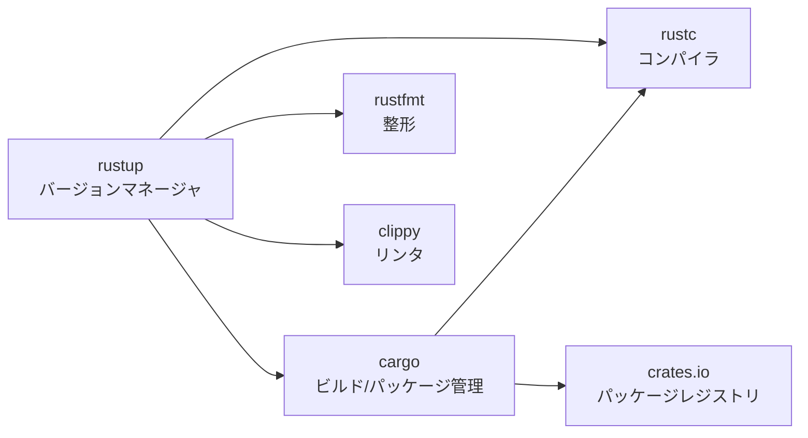
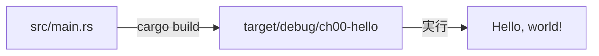

# 00. 環境構築と Cargo

## 学習目標

- Rust ツールチェイン（rustup / rustc / cargo）の関係を理解する
- `cargo new` から `cargo run` までの基本ワークフローを身につける
- `cargo fmt` `cargo clippy` を最初から習慣にする

## ツールチェインの全体像



| ツール | 役割 | Go での対応 |
|------|-----|----------|
| rustup | ツールチェインのバージョン管理 | `goenv` / `gvm` |
| rustc | コンパイラ | `go build` の中で呼ばれる |
| cargo | ビルド・依存解決・実行 | `go` コマンド全般 |
| rustfmt | 整形 | `gofmt` |
| clippy | 静的解析 | `go vet` / `staticcheck` |

普段触るのは基本 `cargo` だけ。

## インストール

```bash
# rustup 経由でインストール（推奨）
curl --proto '=https' --tlsv1.2 -sSf https://sh.rustup.rs | sh

# シェルを再起動するか、現在のシェルに PATH を通す
# bash / zsh の場合
source "$HOME/.cargo/env"
# fish の場合
source "$HOME/.cargo/env.fish"

# 確認
rustc --version
cargo --version
```

エディタ統合は `rust-analyzer` を入れる。VS Code なら拡張機能、Neovim なら LSP 設定。

## Cargo の基本ワークフロー

このチュートリアルのコード置き場として、まずディレクトリを作る。

```bash
cd ~/src/github.com/violetyk/study-rust
mkdir -p code
cd code
```

最初のプロジェクトを作る。

```bash
cargo new ch00-hello
cd ch00-hello
```

生成されるもの:

```
ch00-hello/
├── Cargo.toml      # プロジェクト定義（go.mod / composer.json 相当）
├── Cargo.lock      # 依存の固定（go.sum 相当、後で生成される）
├── .gitignore
└── src/
    └── main.rs     # エントリポイント
```

`Cargo.toml` を覗いてみる:

```toml
[package]
name = "ch00-hello"
version = "0.1.0"
edition = "2024"

[dependencies]
```

`edition` は Rust の言語仕様の世代。`2015 / 2018 / 2021 / 2024` がある。新規プロジェクトは最新を選んでおく。後方互換は維持されるので edition が違っても相互利用できる。

## 走らせる

```bash
cargo run
```

初回は依存解決とコンパイルで少し時間がかかる。`Hello, world!` が出たら成功。

裏で何が起きているか:



主要なサブコマンド:

| コマンド | 役割 |
|--------|-----|
| `cargo build` | ビルドのみ |
| `cargo run` | ビルドして実行 |
| `cargo build --release` | 最適化ビルド（target/release/） |
| `cargo check` | 型チェックのみ（高速） |
| `cargo test` | テスト実行 |
| `cargo doc --open` | ドキュメント生成・ブラウザで開く |
| `cargo add ＜crate＞` | 依存追加 |
| `cargo update` | 依存更新 |

開発中は `cargo check` を多用する。リンクまで通さないので圧倒的に速い。

## fmt と clippy

最初から習慣にしておく。CIにも入れる前提で。

```bash
cargo fmt           # 整形（gofmt 相当）
cargo clippy        # 静的解析（より厳しい警告）
cargo clippy -- -D warnings   # 警告をエラー扱い
```

clippy は「よりイディオマティックな書き方」を提案してくる。学習中は積極的に使うと吉。

## 演習

📝 **演習 0-1**: `src/main.rs` を以下のように書き換えて実行する。

```rust
fn main() {
    let name = std::env::args().nth(1).unwrap_or_else(|| "world".to_string());
    println!("Hello, {name}!");
}
```

```bash
cargo run -- Yuhei
# → Hello, Yuhei!
cargo run
# → Hello, world!
```

`cargo run --` の `--` 以降が、実行ファイルへの引数になる（`go run main.go -- args` と同じ感覚）。

📝 **演習 0-2**: `cargo clippy` を走らせる。何も警告が出ないはず。次に `unwrap_or_else` を `unwrap_or` に書き換えてみる。

```rust
let name = std::env::args().nth(1).unwrap_or("world".to_string());
```

clippy が「`unwrap_or_else` を使え」と警告する。理由を考える（ヒント: `String::from("world")` の評価タイミング）。

## チェックリスト

- [x] `rustc --version` が動く
- [x] `cargo new` で雛形を作れる
- [x] `cargo run` `cargo check` `cargo build --release` の違いを言える
- [x] `cargo fmt` `cargo clippy` を実行できる
- [x] `Cargo.toml` の `edition` が何か説明できる

## 落とし穴

⚠️ **debug ビルドは遅い**: `cargo run` は debug ビルドで最適化されない。ベンチマーク的なことをするときは `--release` を必ず付ける。debug と release で 10〜100 倍違うことがある。

⚠️ **`target/` は巨大**: 数百 MB〜数 GB になる。`.gitignore` に必ず入れる（`cargo new` で自動生成される）。

⚠️ **rust-analyzer は別物**: コンパイラの `rustc` とは別に、IDE 向けの言語サーバ `rust-analyzer` が存在する。`rustup component add rust-analyzer` で入る。

## 補完の正体（Zed など LSP 対応エディタを使っている場合）

Zed の補完ポップアップに出る説明文は、rust-analyzer がソースコード内の rustdoc コメントを LSP 経由でそのまま流しているだけ。書籍のような整った解説ではなく、ライブラリ作者が書いた `///` コメントそのもの。

```rust
/// Returns the contained [`Some`] value or a provided default.
///
/// Arguments passed to `unwrap_or` are eagerly evaluated; if you are
/// passing the result of a function call, it is recommended to use
/// [`unwrap_or_else`], which is lazily evaluated.
pub fn unwrap_or(self, default: T) -> T { ... }
```

| 記法 | 用途 |
|---|---|
| `///` | 直後のアイテム（関数・型・定数など）のドキュメント |
| `//!` | ファイル / モジュール全体のドキュメント（ファイル先頭に書く） |

`cmd+click`（Go to Definition）で std のソースに飛ぶと、補完で見ていた断片を `///` コメントとして直接読める。`cargo doc --open` でプロジェクトと依存 crate のドキュメントを HTML として一括で見られる（補完と同じ内容が整形されて並ぶ）。

標準ライブラリの日本語訳は存在せず自動翻訳の仕組みもないので、気になった API は Zed の Inline Assistant に「日本語で説明して」と聞くのが現実的。
