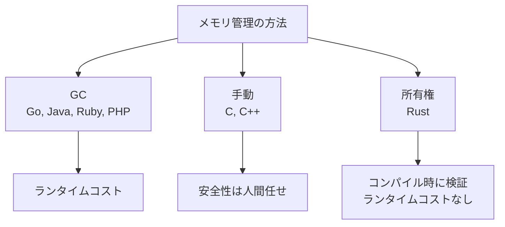

# 02. 所有権と借用

ここが Rust の中核。一度ちゃんと理解すれば、後の章の理解度が劇的に変わる。

## なぜ所有権が必要か

GC のない言語でメモリ安全を保つ仕組み。C/C++ では「いつ free するか」をプログラマが管理する。Rust はこれを型システムで強制する。



Rust が解決したい三大バグ:

1. 二重解放 (double free) — 同じヒープ領域を二度 `free` する
2. 解放後利用 (use after free) — 解放したメモリへのポインタを使う
3. データ競合 (data race) — 複数スレッドから同じデータを同時に読み書きする

## 3 つのルール

1. すべての値には「所有者（owner）」が 1 つだけ存在する
2. 所有者がスコープを抜けると値は drop される
3. 所有者は同時に 1 人だけ

## 学習目標

- move / copy / borrow の違いを区別できる
- `&T` と `&mut T` の借用ルールを言える
- ボローチェッカーのエラーメッセージを読める
- どこに `&` を付ければよいかの直観を持つ

## プロジェクト

```bash
cd code
cargo new ch02-ownership
cd ch02-ownership
```

## ヒープとスタック

Rust の所有権を理解するには、まずどの値がどこに置かれるかを意識する。

| 場所 | 例 |
|-----|----|
| スタック | `i32`, `bool`, `[u8; 16]`, タプル（中身も Copy なら） |
| ヒープ | `String`, `Vec<T>`, `Box<T>`, `HashMap` |

スタックの値は安いので「コピー」で済む。ヒープの値は「所有権の移動（move）」で扱う。

詳しく: [スタックとヒープ](explanations/stack-and-heap.md)

## Move（所有権の移動）

```rust
fn main() {
    let s1 = String::from("hello");
    let s2 = s1;             // ← move。s1 はもう使えない
    // println!("{s1}");     // ❌ value borrowed here after move
    println!("{s2}");        // ✅
}
```

これは Go との一番の違い。Go なら参照を 2 つ持てる。Rust は「持ち主は 1 人」。

```mermaid
flowchart LR
    subgraph スタック
        s1["s1<br/>(無効化)"]
        s2["s2<br/>ptr/len/cap"]
    end
    subgraph ヒープ
        h["'hello'"]
    end
    s2 --> h
    s1 -.x.-> h
```

詳しく: [所有のラインは 1 本だけ](explanations/move-and-ownership-line.md)

## Copy トレイト

スタックに収まる値は move ではなくコピーされる。これは `Copy` トレイトを実装する型に対する特別扱い。

```rust
let x = 5;
let y = x;        // x もまだ使える（i32 は Copy）
println!("{x} {y}");
```

Copy を実装している主な型:

- すべての整数・浮動小数・bool・char
- すべて Copy な要素のタプル
- 固定長配列（要素が Copy なら）
- 参照 `&T`（参照そのものはアドレス値なので Copy）

`String` `Vec<T>` は Copy ではない。理由は「ヒープ確保したリソースを 2 重に解放したくない」から。

詳しく: [Copy と Clone](explanations/copy-and-clone.md)

## 関数と所有権

```rust
fn take(s: String) {
    println!("{s}");
}   // ← ここで s が drop される

fn main() {
    let s = String::from("hi");
    take(s);
    // println!("{s}");   // ❌ s はもう所有権がない
}
```

引数に渡すと所有権が関数に移る。返したいなら戻り値で返す（タプルで返したり…はだるい）。

これだと使い物にならないので「借用」が必要になる。

## 借用（Borrow）: `&T`

「所有権を渡さずに参照だけを貸す」のが借用。Go のポインタ `*T` に近いが、安全性のルールがある。

```rust
fn len(s: &String) -> usize {
    s.len()
}   // ← ここで参照は消えるが、文字列そのものは drop されない

fn main() {
    let s = String::from("hi");
    let n = len(&s);    // 借用（&）で渡す
    println!("{s} = {n}");   // ✅ s はまだ使える
}
```

`&` が借用、`*` が参照外し（dereference）。多くの場面で `*` は自動で挿入されるので書かなくて良い。

### 参照外し (`*`) の例

`*` は「参照の矢印をたどって、矢印の先にある中身を取り出す」操作。

```rust
let x = 5;
let r = &x;          // r は &i32（x への参照）
println!("{}", *r);  // ← *r で中身を取り出す → 5

let mut y = 10;
let mr = &mut y;
*mr += 1;            // ← *mr で書き換え対象を指定
println!("{y}");     // 11
```

`mr = 11` と書くと「`mr` が指す先を別の場所に変える」になってしまう。書き換えるには `*mr = ...` のように参照外しが必要。

Go との対比 ―― シンタックスはほぼ同じ:

| Go | Rust |
|---|---|
| `p := &x` | `let p = &x;` |
| `*p` で取り出し | `*p` で取り出し |
| `*p = 10` で書き換え | `*p = 10` で書き換え（ただし `&mut` のみ） |

ただし実務では `*` を書く場面はかなり少ない。メソッド呼び出し時に自動で `*` が挿入されるから:

```rust
let s = String::from("hello");
let r = &s;
println!("{}", r.len());   // ← (*r).len() の糖衣構文
```

詳しく: [参照と参照外し](explanations/reference-and-deref.md)

### 借用の 2 種類

| 種類 | 書き方 | 何ができる |
|-----|------|----------|
| 共有借用（不変参照） | `&T` | 読み出しのみ |
| 排他借用（可変参照） | `&mut T` | 読み書き |

可変参照を取るには、元の変数も `mut` でなければならない。

```rust
fn push_world(s: &mut String) {
    s.push_str(", world");
}

fn main() {
    let mut s = String::from("hello");
    push_world(&mut s);
    println!("{s}");
}
```

### 借用ルール（一番大事）

ある時点で同じ値に対して持てるのは:

- 不変参照 `&T` を 何個でも、または
- 可変参照 `&mut T` を ただ 1 つだけ

両者は同時に持てない。

```rust
let mut s = String::from("hi");
let r1 = &s;
let r2 = &s;        // ✅ 不変参照は何個でも OK
println!("{r1} {r2}");
let r3 = &mut s;    // ✅ ここでは r1, r2 はもう使われていない（NLL）
r3.push('!');
```

```rust
let mut s = String::from("hi");
let r1 = &s;
let r2 = &mut s;    // ❌ 不変と可変は同時に持てない
println!("{r1}");
```

これが「データ競合をコンパイル時に防ぐ」仕組み。マルチスレッドだけでなく、シングルスレッドでも反復中の破壊的変更などを防いでくれる。

詳しく: [借用ルール vs SQL の MVCC](explanations/borrow-rules-and-mvcc.md)

### NLL（Non-Lexical Lifetime）

「借用が最後に使われる場所」までで参照は終わる、と Rust は賢く判断する。

```rust
let mut s = String::from("hi");
let r1 = &s;
println!("{r1}");      // ← この時点で r1 の役目は終わり
let r2 = &mut s;       // ✅ r1 はもう使われないので OK
r2.push('!');
```

エラーが出たときは「いつまで参照が生きている扱いになっているか」を読む。

## ダングリング参照は作れない

```rust
fn dangle() -> &String {     // ❌
    let s = String::from("hi");
    &s
}   // s は drop されるので、参照は無効
```

C なら未定義動作で死ぬが、Rust はコンパイルが通らない。

## クローンが必要なケース

どうしても 2 つ独立の値が欲しいときは `clone()`。

```rust
let s1 = String::from("hi");
let s2 = s1.clone();   // ヒープ全体をコピー（コスト大）
println!("{s1} {s2}");
```

コストが高い操作なので、Rust では「無意識に」clone は呼ばない。Go の値型コピーとは思想が違う。

## スライス: `&str` と `&[T]`

「文字列の一部」「配列の一部」を借りる仕組み。

```rust
let s = String::from("hello world");
let hello: &str = &s[0..5];     // "hello"
let world: &str = &s[6..11];    // "world"

let v = vec![1, 2, 3, 4, 5];
let slice: &[i32] = &v[1..3];   // [2, 3]
```

⚠️ 文字列のスライスはバイト境界を意識すること（マルチバイト文字を切ると panic）。

## 関数引数: `&str` を取るのが定石

```rust
fn first_word(s: &str) -> &str {
    s.split_whitespace().next().unwrap_or("")
}

fn main() {
    let s = String::from("hello world");
    println!("{}", first_word(&s));     // String → &str に自動で deref
    println!("{}", first_word("foo bar"));  // 文字列リテラルもそのまま渡せる
}
```

「文字列を読みたいだけの関数」は `&String` ではなく `&str` を取る、が定石。汎用性が上がる。

## 演習

📝 **演習 2-1**: 次のコードはコンパイルが通らない。エラーメッセージを読み、3 通りの方法（move を返す / clone する / 借用にする）でそれぞれ修正せよ。

```rust
fn main() {
    let s = String::from("hi");
    let len = compute_len(s);
    println!("{} の長さは {}", s, len);
}

fn compute_len(s: String) -> usize {
    s.len()
}
```

📝 **演習 2-2**: `Vec<i32>` を受け取り、要素の合計と最大値を返す関数を、所有権を奪わずに実装せよ。シグネチャは自分で考える。

📝 **演習 2-3**: 次のコードは借用ルール違反でエラーになる。なぜダメなのかをコメントで言語化してから修正せよ。

```rust
fn main() {
    let mut v = vec![1, 2, 3];
    let first = &v[0];
    v.push(4);
    println!("{first}");
}
```

ヒント: `Vec` は容量が足りなくなると再確保（reallocation）する。古いポインタが指す先は…？

## チェックリスト

- [ ] move と copy の違いが言える
- [ ] `&T` と `&mut T` の同時所持ルールが言える
- [ ] NLL のおかげで「参照を使い終われば次の借用ができる」を体感した
- [ ] `String` を引数に取る代わりに `&str` を使う理由が言える
- [ ] エラーメッセージから「どこで借用が起きていて、どこと衝突しているか」を読める

## 落とし穴

⚠️ **`&String` より `&str` を引数に取る**: 関数のインターフェースとして `&str` の方が呼び出し側の選択肢が広い。

⚠️ **clone を乱発しない**: 学習中はやむを得ないが、本番コードでは「なぜ clone するのか」を答えられるようにする。多くの場合、設計を見直すべきサイン。

⚠️ **`Vec` の reallocation で参照が無効になる**: 演習 2-3 がそれ。だから「不変借用中に push できない」がコンパイラに弾かれる。

⚠️ **戻り値での move は OK**: 「所有権を返す」のは合法かつイディオム的。`fn make_string() -> String` のような関数は普通に書ける。

⚠️ **エラーメッセージを最後まで読む**: Rust のコンパイラは丁寧で、`help:` `note:` まで含めて修正案を提示してくれる。慣れるまでは全部読む。
