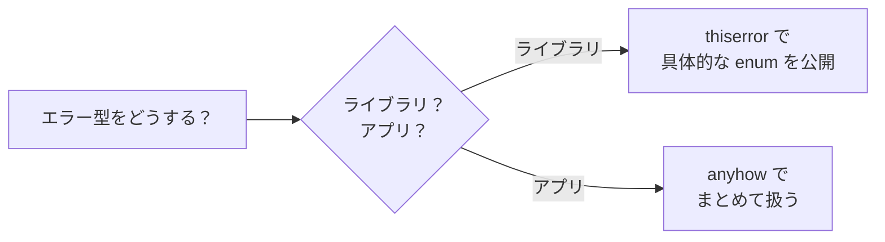

# 04. エラーハンドリング

## 学習目標

- `Option<T>` で「値があるかも」を表現できる
- `Result<T, E>` で「成否」を表現できる
- `?` 演算子でエラー伝播を簡潔に書ける
- `anyhow` / `thiserror` の使い分けができる
- いつ panic していいか判断できる

Rust には例外がない。Go の `(T, error)` に近いが、型システムで「エラーを無視できない」のが特徴。

## プロジェクト

```bash
cd code
cargo new ch04-errors
cd ch04-errors
```

## Option<T>: 値がないかもしれない

null / nil の代わり。`std::option::Option` は実は単なる enum。

```rust
enum Option<T> {
    Some(T),
    None,
}
```

```rust
fn find_user(id: u64) -> Option<String> {
    if id == 1 {
        Some(String::from("Yuhei"))
    } else {
        None
    }
}

fn main() {
    match find_user(1) {
        Some(name) => println!("found: {name}"),
        None => println!("not found"),
    }
}
```

| 言語 | nil 相当 |
|------|---------|
| Rust | `Option<T>::None` |
| Go | `nil` ポインタ / zero value |
| PHP / Ruby | `null` / `nil` |

ポイントは「`Option` を剥がさないと中身を使えない」こと。null チェック忘れがコンパイル時に防げる。

## Option の便利メソッド

```rust
let x: Option<i32> = Some(5);

x.is_some();              // bool
x.unwrap();               // 5（None なら panic）
x.unwrap_or(0);           // 値 or デフォルト
x.unwrap_or_else(|| 0);   // 値 or クロージャ評価
x.expect("must exist");   // メッセージ付き panic

x.map(|n| n * 2);             // Option<i32> → Option<i32>
x.and_then(|n| if n > 0 { Some(n) } else { None });  // モナディックバインド
x.ok_or("error");             // Option<T> → Result<T, E>
```

`map` `and_then` で「`None` ならスキップ」のチェーンが書ける。これが Result との一貫性を生む。

## Result<T, E>: 失敗するかもしれない

```rust
enum Result<T, E> {
    Ok(T),
    Err(E),
}
```

```rust
fn parse_age(s: &str) -> Result<u32, std::num::ParseIntError> {
    s.parse::<u32>()
}

fn main() {
    match parse_age("44") {
        Ok(n) => println!("age={n}"),
        Err(e) => println!("error: {e}"),
    }
}
```

Go との対比:

```go
// Go
n, err := strconv.Atoi("44")
if err != nil { return err }
```

```rust
// Rust（次節）
let n = "44".parse::<u32>()?;
```

## `?` 演算子: エラー伝播の決定版

`Result<T, E>` に `?` を付けると「Ok なら中身を取り出し、Err なら関数から早期 return」。

```rust
fn parse_two(a: &str, b: &str) -> Result<u32, std::num::ParseIntError> {
    let x = a.parse::<u32>()?;
    let y = b.parse::<u32>()?;
    Ok(x + y)
}
```

これは Go の以下と等価:

```go
func parseTwo(a, b string) (uint32, error) {
    x, err := strconv.ParseUint(a, 10, 32)
    if err != nil { return 0, err }
    y, err := strconv.ParseUint(b, 10, 32)
    if err != nil { return 0, err }
    return uint32(x) + uint32(y), nil
}
```

`?` は `Option` にも使える（None なら早期 return）。ただし関数の戻り値も `Option`/`Result` でないとダメ。

## エラー型を統一する: `From` 変換

複数のエラー型を扱うとき、`?` は自動で `From::from` を呼んで変換してくれる。

```rust
use std::num::ParseIntError;
use std::io;

#[derive(Debug)]
enum AppError {
    Parse(ParseIntError),
    Io(io::Error),
}

impl From<ParseIntError> for AppError {
    fn from(e: ParseIntError) -> Self {
        AppError::Parse(e)
    }
}

impl From<io::Error> for AppError {
    fn from(e: io::Error) -> Self {
        AppError::Io(e)
    }
}

fn run() -> Result<(), AppError> {
    let s = std::fs::read_to_string("data.txt")?;   // io::Error → AppError
    let n: u32 = s.trim().parse()?;                  // ParseIntError → AppError
    println!("{n}");
    Ok(())
}
```

毎回これを書くのはだるいので、実用では `thiserror` クレートを使う。

## thiserror: ライブラリのエラー型に

`Cargo.toml`:

```toml
[dependencies]
thiserror = "2"
```

または `cargo add thiserror`。

```rust
use thiserror::Error;

#[derive(Debug, Error)]
enum AppError {
    #[error("parse error: {0}")]
    Parse(#[from] std::num::ParseIntError),

    #[error("io error: {0}")]
    Io(#[from] std::io::Error),

    #[error("invalid input: {message}")]
    InvalidInput { message: String },
}
```

`#[from]` で `From` 実装を自動生成。`#[error("...")]` で `Display` 実装を生成。これだけで自前 enum を `?` で統一できる。

ライブラリ作者は `thiserror` を使う。「型として何が起きたか」を呼び出し側に伝える義務があるため。

## anyhow: アプリケーションのエラー型に

`Cargo.toml`:

```toml
[dependencies]
anyhow = "1"
```

```rust
use anyhow::{Result, Context, anyhow, bail};

fn run() -> Result<()> {
    let s = std::fs::read_to_string("data.txt")
        .context("config file is required")?;     // 文脈を付け足す
    let n: u32 = s.trim().parse()
        .with_context(|| format!("failed to parse: {s:?}"))?;

    if n == 0 {
        bail!("n must be positive");              // 早期エラー
    }
    if n > 100 {
        return Err(anyhow!("too big: {n}"));
    }

    println!("{n}");
    Ok(())
}
```

`anyhow::Result<T>` は `Result<T, anyhow::Error>` のエイリアス。`anyhow::Error` は「どんなエラーでも box して持つ」型。アプリケーション開発で「どのエラー型かは気にせずまとめて扱いたい」ときに最強。



## main を Result にする

```rust
fn main() -> anyhow::Result<()> {
    let s = std::fs::read_to_string("data.txt")?;
    println!("{s}");
    Ok(())
}
```

`main` が `Result` を返せる。`Err` で終了するとエラーが整形表示されてプロセスが非ゼロ終了する。

## panic vs Result

| 状況 | 使うべきもの |
|-----|-----------|
| 不正な入力（外部由来） | `Result` |
| プログラムの不変条件違反（バグ） | `panic!` |
| まだ実装してない | `todo!()` / `unimplemented!()` |
| 到達しないはず | `unreachable!()` |
| プロトタイプ・PoC | `unwrap()` / `expect()` |

```rust
let n: u32 = "abc".parse().expect("config が壊れている");  // 起動時バリデーション
```

`unwrap()` を本番コードに残さないこと。代わりに `expect("...")` で「壊れたら何が言いたいか」を書く。

## 演習

📝 **演習 4-1**: `&str` を 2 つ受け取り、両方を `i32` にパースして商を返す関数 `fn divide(a: &str, b: &str) -> Result<i32, String>` を実装せよ。`b == 0` のときも `Err` を返す。

📝 **演習 4-2**: `anyhow` を入れて、`std::env::args` から 2 つの数値を取り、足し算した結果を表示する `main` を書け。引数不足・パース失敗・桁あふれを `?` と `context` で扱う。

```bash
cargo add anyhow
cargo run -- 1 2     # → 3
cargo run -- 1 abc   # → エラー（context 付き）
cargo run -- 1       # → エラー（引数不足）
```

📝 **演習 4-3**: `thiserror` を使って、以下のエラー enum を定義せよ。

```rust
// 在庫サービスのエラー
enum StockError {
    NotFound { sku: String },        // 商品なし
    OutOfStock { sku: String, requested: u32, available: u32 },
    Db(/* sqlx::Error など */),       // 下位エラーを from で包む
}
```

`Display` と `Error` を thiserror で導出。

## チェックリスト

- [ ] `Option` と `Result` の違いが言える
- [ ] `?` の動きを説明できる
- [ ] `From` で変換が自動的に行われる仕組みを説明できる
- [ ] `anyhow` と `thiserror` の使い分けが言える
- [ ] `unwrap` と `expect` をいつ使うか判断できる

## 落とし穴

⚠️ **`unwrap()` は panic する**: PoC では便利だが、本番に残すと運用事故。`expect("...")` か `?` に置き換える。

⚠️ **`?` は関数の戻り値を要求する**: `main` でも `Result` を返すように直す必要がある。

⚠️ **`anyhow::Error` の中身は型として取り出せない**: アプリ層でしか使わない。ライブラリの公開 API には絶対入れない。

⚠️ **panic は recoverable とは限らない**: マルチスレッドではスレッド単体が落ちるだけだが、main スレッドが落ちるとプロセスごと終わる。`std::panic::catch_unwind` はあるが、頼らない設計を。

⚠️ **エラーログは Display か Debug か**: 表面に出すなら `{}`（Display）、開発者向けなら `{:?}` / `{:#?}`（Debug）。anyhow のエラーは `{:#}` で context チェーン全部出る（地味に便利）。
