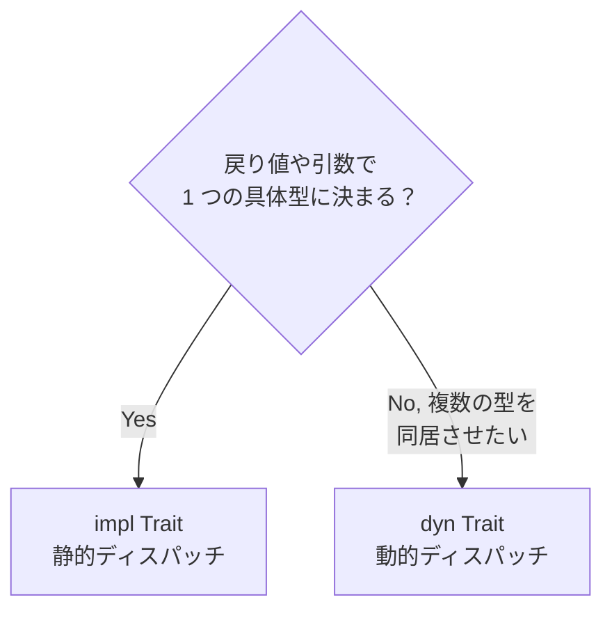

# 05. トレイトとジェネリクス

## 学習目標

- `trait` でインターフェースを定義し、`impl` で実装できる
- ジェネリクスとトレイト境界を書ける
- `impl Trait` と `dyn Trait` の違いを理解する
- 標準ライブラリの主要トレイト（`Display`, `Debug`, `Clone`, `Iterator`, `From/Into`）を使い分けられる

Go の interface に近いが、より強力。「振る舞いを抽象化する」だけでなく「型に対して後付けで実装を加える」「演算子オーバーロード」「シリアライズ」など多目的に使われる。

## プロジェクト

```bash
cd code
cargo new ch05-traits
cd ch05-traits
```

## trait の基本

```rust
trait Greet {
    fn hello(&self) -> String;            // 抽象メソッド
    fn shout(&self) -> String {            // デフォルト実装あり
        format!("{}!!!", self.hello())
    }
}

struct En;
struct Ja;

impl Greet for En {
    fn hello(&self) -> String {
        "Hello".to_string()
    }
}

impl Greet for Ja {
    fn hello(&self) -> String {
        "こんにちは".to_string()
    }
    // shout はデフォルト実装をそのまま使う
}

fn main() {
    println!("{}", En.shout());   // Hello!!!
    println!("{}", Ja.shout());   // こんにちは!!!
}
```

Go の interface との違い:

| 項目 | Rust trait | Go interface |
|-----|-----------|--------------|
| 実装の宣言 | 明示（`impl Trait for Type`） | 暗黙（メソッドが揃ってればOK） |
| デフォルトメソッド | あり | なし |
| 関連型 | あり（`type` で定義） | なし |
| ジェネリクス連携 | 強力 | 1.18 以降あり |
| 実装場所 | 型 or trait のどちらかが自前でないとダメ（孤児ルール） | 制限なし |

## ジェネリクス

```rust
fn largest<T: PartialOrd>(list: &[T]) -> &T {
    let mut largest = &list[0];
    for item in list {
        if item > largest {
            largest = item;
        }
    }
    largest
}

fn main() {
    let nums = vec![10, 25, 3, 47, 9];
    println!("{}", largest(&nums));      // 47

    let chars = vec!['y', 'a', 'z', 'b'];
    println!("{}", largest(&chars));     // z
}
```

`T: PartialOrd` が「トレイト境界」。`T` には「`<` `>` で比較できる型」しか入れられないことを保証する。

### `where` 句

複雑な境界は `where` で後置する。

```rust
fn process<T, U>(t: T, u: U) -> String
where
    T: std::fmt::Display + Clone,
    U: std::fmt::Debug,
{
    format!("{} {:?}", t, u)
}
```

### 構造体・enum・impl ブロックでも

```rust
struct Pair<T> {
    a: T,
    b: T,
}

impl<T: std::fmt::Display> Pair<T> {
    fn print(&self) {
        println!("({}, {})", self.a, self.b);
    }
}
```

## 標準ライブラリの主要トレイト

| トレイト | 役割 |
|---------|-----|
| `Display` | `{}` フォーマット（人向け） |
| `Debug` | `{:?}` フォーマット（開発者向け） |
| `Clone` / `Copy` | 複製 |
| `PartialEq` / `Eq` | `==` |
| `PartialOrd` / `Ord` | 順序 |
| `Hash` | ハッシュ可 |
| `Default` | `Default::default()` |
| `From` / `Into` | 型変換 |
| `Iterator` | イテレータ |
| `Drop` | デストラクタ |
| `Deref` / `DerefMut` | `*` 経由のアクセス |
| `Send` / `Sync` | スレッド安全（自動実装） |

### Display の実装例

```rust
use std::fmt;

struct UserId(u64);

impl fmt::Display for UserId {
    fn fmt(&self, f: &mut fmt::Formatter<'_>) -> fmt::Result {
        write!(f, "user:{}", self.0)
    }
}

fn main() {
    println!("{}", UserId(42));   // user:42
}
```

### From / Into

「型変換のトレイト」。`From` を実装すると `Into` は自動で導出される。

```rust
struct Email(String);

impl From<&str> for Email {
    fn from(s: &str) -> Self {
        Email(s.to_lowercase())
    }
}

fn main() {
    let e: Email = "Yuhei@Example.com".into();
    let e2 = Email::from("Yuhei@Example.com");
    println!("{}", e.0);   // yuhei@example.com
}
```

関数引数を `impl Into<String>` などにすると、呼び出し側が柔軟になる。

## `impl Trait` vs `dyn Trait`

トレイトを「型のように」使う方法が 2 つある。

### `impl Trait`（静的ディスパッチ）

```rust
fn make_greeter() -> impl Greet {
    En                         // 戻り値は具体的な型だが、呼び出し側には Greet として見える
}

fn say(g: &impl Greet) {       // 引数も書ける
    println!("{}", g.hello());
}
```

- コンパイル時に具体型に展開される（モノモルフィゼーション）
- 高速、インライン化されやすい
- ただし「異なる型を同じコンテナに入れる」はできない

### `dyn Trait`（動的ディスパッチ）

```rust
fn make_greeter(lang: &str) -> Box<dyn Greet> {
    match lang {
        "ja" => Box::new(Ja),
        _ => Box::new(En),
    }
}

let greeters: Vec<Box<dyn Greet>> = vec![Box::new(En), Box::new(Ja)];
for g in &greeters {
    println!("{}", g.hello());
}
```

- vtable 経由のメソッド呼び出し（Go interface と同じ仕組み）
- `Vec<Box<dyn Trait>>` のように異なる型をまとめられる
- 若干遅い（ただし無視できる範囲のことが多い）

判断軸:



⚠️ `dyn Trait` を使えるトレイトは「object-safe」（オブジェクト安全）でなければならない。`Self` を返すメソッドや、ジェネリックメソッドがあると不可。

## 関連型

トレイト内で「実装側が決める型」を持てる。`Iterator` が代表例。

```rust
trait Iterator {
    type Item;                                  // 関連型
    fn next(&mut self) -> Option<Self::Item>;
}

struct Counter { n: u32 }

impl Iterator for Counter {
    type Item = u32;
    fn next(&mut self) -> Option<u32> {
        self.n += 1;
        if self.n <= 5 { Some(self.n) } else { None }
    }
}
```

ジェネリック型パラメータと関連型の使い分け:

- 「1 つの型に対して複数の実装があり得る」なら型パラメータ（`From<T>` は `From<&str>` も `From<i32>` も実装できる）
- 「1 つの型に対して実装は 1 つに決まる」なら関連型（`Iterator::Item` は `Vec<i32>::Item = i32` で確定）

## トレイトを引数で使い分ける

```rust
// 1. 具体的な参照
fn f1(s: &str) {}

// 2. ジェネリクス + トレイト境界（推奨）
fn f2<T: AsRef<str>>(s: T) {
    let s: &str = s.as_ref();
}

// 3. impl Trait（短い）
fn f3(s: impl AsRef<str>) {
    let s = s.as_ref();
}

// 4. dyn Trait（オブジェクト安全な場合）
fn f4(g: &dyn Greet) {}
```

`AsRef<str>` を取れば `&str`, `String`, `&String`, `Cow<str>` など何でも受けられる。便利な定石。

## 演習

📝 **演習 5-1**: `Shape` トレイトを定義し、`area()` と `perimeter()` を要求せよ。`Circle { radius: f64 }` と `Rectangle { w: f64, h: f64 }` を定義して実装。`Vec<Box<dyn Shape>>` に両方を入れて、合計面積を計算する関数を作る。

📝 **演習 5-2**: 自前の構造体 `Money { amount: u64, currency: String }` に `Display` を実装。`"1000 JPY"` のように出力させる。

📝 **演習 5-3**: 以下のシグネチャを 3 通り（ジェネリクス境界 / impl Trait / dyn Trait）で書き、それぞれの違いを説明せよ。

```rust
// 「Display を実装した何か」のスライスを受け取り、改行区切りで連結した String を返す
fn join_lines(?) -> String;
```

## チェックリスト

- [ ] trait と impl の関係が説明できる
- [ ] ジェネリクスとトレイト境界が書ける
- [ ] `impl Trait` と `dyn Trait` を使い分けられる
- [ ] 標準ライブラリの主要トレイトを 5 つ挙げられる
- [ ] 関連型と型パラメータの違いが言える

## 落とし穴

⚠️ **孤児ルール（orphan rule）**: 「型」と「trait」のどちらかが自前のものでないと `impl Trait for Type` は書けない。これは依存衝突を防ぐため。`impl std::fmt::Display for Vec<i32>` は不可。回避策は newtype（`struct MyVec(Vec<i32>)` を作って impl）。

⚠️ **`dyn Trait` は object-safe な trait に限られる**: `Self` を返すメソッドやジェネリックメソッドがあると入れられない。エラーが出たら、対象 trait の API を見直す。

⚠️ **`Box<dyn Trait>` のサイズはポインタサイズ**: `dyn Trait` 自体はサイズ不定なので、`Box` などのインダイレクションが必要。

⚠️ **`Display` と `Debug` を間違えない**: 人向け表示は `Display`（`{}`）、開発者向けは `Debug`（`{:?}`）。エラーログには Debug が便利。

⚠️ **ジェネリクスは膨らむ**: モノモルフィゼーションでバイナリサイズが増える。極端な例では `dyn Trait` の方がいい場合もある。
