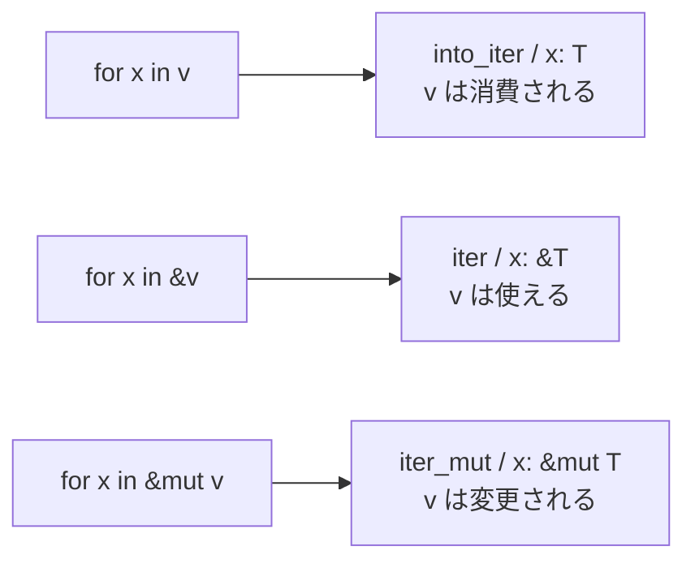

# 06. コレクションとイテレータ

## 学習目標

- `Vec<T>` `String` `HashMap<K, V>` の基本操作を覚える
- `iter()` `iter_mut()` `into_iter()` の違いが言える
- `map` `filter` `collect` を使ってデータ変換を関数型風に書ける
- イテレータが遅延評価であることを理解する

Go の slice / map と似ているが、所有権と借用の絡みで挙動が違う。ここで `&` の感覚をさらに掴む。

## プロジェクト

```bash
cd code
cargo new ch06-collections
cd ch06-collections
```

## Vec<T>

可変長配列。Go の slice 相当。

```rust
let mut v: Vec<i32> = Vec::new();
v.push(1);
v.push(2);
v.push(3);

let v = vec![1, 2, 3];          // マクロでまとめて
let zeros = vec![0; 10];        // [0, 0, ..., 0]（長さ 10）

println!("{}", v[0]);            // 1（範囲外なら panic）
println!("{:?}", v.get(10));     // None（安全な取得）

for x in &v {                    // 借用で反復（推奨）
    println!("{x}");
}

for x in &mut v {                // 可変借用で反復
    *x += 1;
}

let sum: i32 = v.iter().sum();
let max = v.iter().max();        // Option<&i32>
```

### 操作のチートシート

| 操作 | メソッド |
|-----|--------|
| 末尾追加 | `push(x)` |
| 末尾削除 | `pop()` → `Option<T>` |
| 任意位置に挿入 | `insert(i, x)` |
| 任意位置から削除 | `remove(i)` |
| 並べ替え | `sort()`（要 `Ord`）/ `sort_by(\|a, b\| ...)` |
| 反転 | `reverse()` |
| 重複削除 | `dedup()` |
| 連結 | `extend(other)` / `concat()` |
| 検索 | `contains(&x)` / `iter().position(...)` |

## String と &str（再訪）

| 型 | 役割 |
|---|-----|
| `String` | 所有・可変・ヒープ |
| `&str` | スライス参照（read-only） |
| `&mut str` | あまり使わない（バイト編集はバイト単位） |
| `Box<str>` | 所有するが伸縮しない |

```rust
let mut s = String::new();
s.push_str("hello");
s.push(' ');
s.push_str("world");

let s2 = String::from("abc");
let s3 = s2 + "def";        // s2 は move される（+ は左を消費する）

let parts: Vec<&str> = "a,b,c".split(',').collect();
let joined = parts.join("|");

let upper = "abc".to_uppercase();   // String
let len_bytes = "あ".len();          // 3（バイト単位）
let len_chars = "あ".chars().count();// 1
```

⚠️ Rust の文字列は UTF-8 バイト列。`len()` はバイト長。文字数は `chars().count()`。インデックス `s[i]` でバイト取得もできない（`s.as_bytes()[i]` ならOK）。

## HashMap<K, V>

```rust
use std::collections::HashMap;

let mut scores: HashMap<String, i32> = HashMap::new();
scores.insert("Alice".to_string(), 90);
scores.insert("Bob".to_string(), 85);

if let Some(s) = scores.get("Alice") {
    println!("{s}");
}

// なければ挿入、あれば更新
scores.entry("Carol".to_string()).or_insert(0);
*scores.entry("Alice".to_string()).or_insert(0) += 5;   // カウンタ的更新

for (k, v) in &scores {
    println!("{k}: {v}");
}
```

`entry().or_insert()` は超頻出のイディオム。Go の `if _, ok := m[k]; !ok { m[k] = ... }` を 1 行で。

ハッシュ可能なキーが必要（`Hash + Eq` を満たす）。`HashMap<UserId, ...>` のためには `UserId` に `#[derive(Hash, Eq, PartialEq)]` を付ける。

ほかに `BTreeMap`（ソート済み）`HashSet` `BTreeSet` `VecDeque`（両端キュー）`LinkedList` あり。

## イテレータ

`Iterator` トレイトを実装した型。「次の要素を返す」`next()` だけ持っている。これに大量のデフォルト実装メソッドがついている。

### iter / iter_mut / into_iter の違い

```rust
let v = vec![1, 2, 3];

// 1. iter(): &T を返す（借用）
for x in v.iter() {           // x: &i32
    println!("{x}");
}
// v はまだ使える

// 2. iter_mut(): &mut T を返す（可変借用）
let mut v = vec![1, 2, 3];
for x in v.iter_mut() {       // x: &mut i32
    *x += 10;
}

// 3. into_iter(): T を返す（所有権を奪う）
for x in v.into_iter() {      // x: i32
    println!("{x}");
}
// v はもう使えない
```

`for x in &v` は `v.iter()`、`for x in &mut v` は `v.iter_mut()`、`for x in v` は `v.into_iter()` の糖衣構文。



### 遅延評価

イテレータは「呼ばれるまで動かない」。中間処理（`map`, `filter`）はチェーンを組み立てるだけで、`collect` などの終端操作で初めて消費される。

```rust
let v = vec![1, 2, 3, 4, 5];

// このチェーンはまだ何も計算しない
let it = v.iter()
    .map(|x| x * 2)
    .filter(|x| x > &4);

// collect でようやく走る
let result: Vec<i32> = it.collect();
println!("{result:?}");      // [6, 8, 10]
```

### 主要メソッド

| 種類 | メソッド | 役割 |
|-----|--------|-----|
| 中間 | `map(\|x\| ...)` | 写像 |
| 中間 | `filter(\|x\| ...)` | 抽出 |
| 中間 | `take(n)` | 先頭 n 個 |
| 中間 | `skip(n)` | 先頭 n 個を飛ばす |
| 中間 | `enumerate()` | (i, x) のペア |
| 中間 | `zip(other)` | 2 系列を組にする |
| 中間 | `chain(other)` | 連結 |
| 中間 | `flatten()` / `flat_map(...)` | 平坦化 |
| 中間 | `rev()` | 逆順 |
| 中間 | `peekable()` | 先読み可能に |
| 終端 | `collect()` | コレクションへ |
| 終端 | `count()` | 個数 |
| 終端 | `sum()` / `product()` | 合計 / 積 |
| 終端 | `max()` / `min()` | 最大 / 最小 |
| 終端 | `find(\|x\| ...)` | 最初に該当 |
| 終端 | `any(\|x\| ...)` / `all(\|x\| ...)` | 述語 |
| 終端 | `fold(init, \|acc, x\| ...)` | 畳み込み |
| 終端 | `for_each(\|x\| ...)` | 副作用 |
| 終端 | `reduce(\|acc, x\| ...)` | 初期値なし畳み込み |

### 実用例

```rust
let words = vec!["apple", "banana", "cherry", "date"];

// 大文字化して長さでソート
let sorted: Vec<String> = words.iter()
    .map(|s| s.to_uppercase())
    .collect::<Vec<_>>();
// 注意: sort はイテレータでなく Vec 上で

// 5 文字以上の単語の文字数の合計
let total: usize = words.iter()
    .filter(|s| s.len() >= 5)
    .map(|s| s.len())
    .sum();

// HashMap への collect
use std::collections::HashMap;
let lengths: HashMap<&str, usize> = words.iter()
    .map(|s| (*s, s.len()))
    .collect();
```

`collect()` は型で「何に集めるか」が決まる。型注釈が必要なことが多い。`.collect::<Vec<_>>()` のターボフィッシュ記法もよく使う。

### Result を返すイテレータの collect

```rust
let strs = vec!["1", "2", "3"];
let nums: Result<Vec<i32>, _> = strs.iter().map(|s| s.parse()).collect();
// → Ok(vec![1, 2, 3])

let strs = vec!["1", "abc", "3"];
let nums: Result<Vec<i32>, _> = strs.iter().map(|s| s.parse()).collect();
// → Err(...)（最初の失敗で止まる）
```

`Result<Vec<T>, E>` に collect すると「どれか失敗したらまとめて Err」を簡潔に書ける。

## クロージャ

```rust
let add = |a, b| a + b;
println!("{}", add(1, 2));

let times = 3;
let triple = |x| x * times;        // times をキャプチャ
println!("{}", triple(5));         // 15
```

クロージャは `Fn` / `FnMut` / `FnOnce` の 3 種類のトレイトのいずれかを満たす。

| トレイト | 役割 |
|---------|-----|
| `Fn` | 不変キャプチャ（何度でも呼べる） |
| `FnMut` | 可変キャプチャ |
| `FnOnce` | キャプチャを消費（一度しか呼べない） |

`move` キーワードで「キャプチャを所有権ごと取り込む」ことができる（スレッドに渡すときに必須）。

## 演習

📝 **演習 6-1**: `Vec<i32>` を受け取り、偶数だけ取り出して 2 倍にした `Vec<i32>` を返す関数を、ループ版とイテレータ版の 2 通りで書け。どちらが読みやすいか比較する。

📝 **演習 6-2**: 文章 `&str` を受け取り、空白で分割し、単語ごとの出現回数を `HashMap<String, usize>` で返す関数を実装せよ。`entry().or_insert(0)` のパターンを使う。

```rust
fn word_count(text: &str) -> HashMap<String, usize> {
    // 実装
}
```

📝 **演習 6-3**: `Vec<&str>` を受け取り、各要素を `i32` にパースした結果の合計を返す関数を、`Result<i32, _>` を返す形で書け。`?` を使うか、`collect::<Result<Vec<_>, _>>()` を使うか、両方試す。

📝 **演習 6-4**: 以下のフィボナッチ数を `Iterator` トレイトを実装して作れ。

```rust
struct Fib { a: u64, b: u64 }

impl Iterator for Fib {
    type Item = u64;
    fn next(&mut self) -> Option<u64> {
        // 実装
    }
}

fn main() {
    let fibs: Vec<u64> = Fib { a: 0, b: 1 }.take(10).collect();
    println!("{fibs:?}");   // [0, 1, 1, 2, 3, 5, 8, 13, 21, 34]
}
```

## チェックリスト

- [ ] `Vec` `String` `HashMap` の基本操作ができる
- [ ] `iter` / `iter_mut` / `into_iter` の違いを説明できる
- [ ] イテレータが遅延評価であることを体感した
- [ ] `collect` で複数のコレクション型を作れる
- [ ] `Iterator` を自前で実装できる

## 落とし穴

⚠️ **`String` のインデックス `s[0]` はできない**: バイト境界の問題。`s.chars().nth(0)` か `s.as_bytes()[0]` を使う。

⚠️ **for ループ中に元のコレクションを変更できない**: `iter()` で借用している間は push できない。collect してから別の vec に作り直すか、`drain()` を使う。

⚠️ **`collect()` の型注釈忘れ**: 戻り型が決まらないとエラー。`Vec<_>` / `HashMap<_, _>` のように受け側の型を書く。

⚠️ **イテレータは消費型**: 一度回したものを再利用できない。再度回したいなら元のコレクションから iter() し直す。

⚠️ **clone を多用しがち**: `iter().map(|s| s.clone()).collect()` の前に「本当に所有権が要るか」を考える。多くの場合 `&str` 参照で十分。
