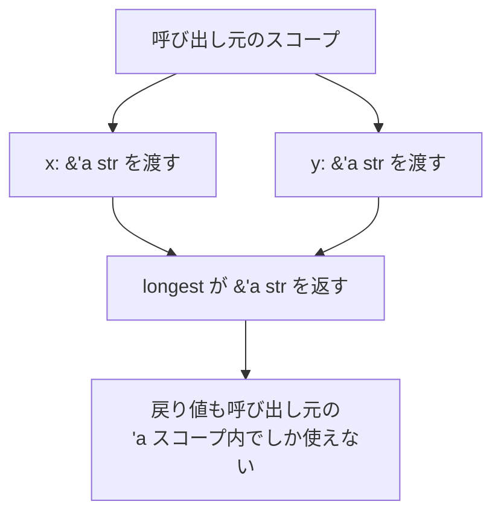

# 07. ライフタイム

02 章の所有権・借用の続編。「参照がどれだけ生きるか」をコンパイラに伝える注釈。

## 学習目標

- ライフタイム注釈 `'a` の意味を読める
- 関数シグネチャの `'a` を書ける
- ライフタイム省略規則を知る
- 構造体に参照を持たせるパターンを理解する
- `'static` を理解する

## なぜ必要か

参照は「指している先よりも長く生きてはいけない」。関数をまたぐと、コンパイラはどの参照とどの参照が同じ寿命を共有するかを推論できない場合がある。そこで人が注釈を付ける。

```rust
// ❌ どっちの引数の参照を返してる？
fn longest(x: &str, y: &str) -> &str {
    if x.len() > y.len() { x } else { y }
}
```

エラー: `expected named lifetime parameter`。

直す:

```rust
// ✅ 'a は「2 つの引数と戻り値が同じスコープを共有する」と宣言
fn longest<'a>(x: &'a str, y: &'a str) -> &'a str {
    if x.len() > y.len() { x } else { y }
}
```

`'a` は「引数として渡される参照のうち、短い方の生存期間」と思っておけばよい。返り値は呼び出し元で「両方が生きている間」だけ有効。

## ライフタイムは「型」ではなく「制約」

`'a` は値ではない。「この参照とこの参照は寿命関係 X を満たす」という制約をコンパイラに教えるラベル。実行時には何も生成されない。



## プロジェクト

```bash
cd code
cargo new ch07-lifetimes
cd ch07-lifetimes
```

## ライフタイム省略規則（Lifetime Elision）

実は、よくあるシグネチャでは `'a` を省略してよい。コンパイラが以下のルールで補ってくれる。

1. 入力参照ごとにそれぞれ別のライフタイムを与える
2. 入力参照が 1 つしかなければ、出力にも同じライフタイムが付く
3. メソッド（`&self` を取る）は、`self` のライフタイムが出力に付く

例:

```rust
fn first_word(s: &str) -> &str { ... }
// 実は: fn first_word<'a>(s: &'a str) -> &'a str
```

```rust
impl Tokenizer {
    fn next_token(&self) -> &str { ... }
    // 実は: fn next_token<'a>(&'a self) -> &'a str
}
```

複数引数で関係性が決まらない場合だけ、明示が必要。

## 構造体に参照を持たせる

参照を持つ構造体はライフタイム注釈が必要。

```rust
struct Excerpt<'a> {
    text: &'a str,
}

impl<'a> Excerpt<'a> {
    fn first_sentence(&self) -> &str {
        self.text.split('.').next().unwrap_or("")
    }
}

fn main() {
    let novel = String::from("First sentence. Second one.");
    let ex = Excerpt { text: &novel };
    println!("{}", ex.first_sentence());
}
```

`Excerpt` は `novel` より長く生きられない。`novel` が drop されると `ex` も使えなくなる、をコンパイラが保証する。

⚠️ 「struct に参照を持たせる」のは設計上の選択肢の一つでしかない。多くのケースでは `String` を所有させた方が楽。参照保持にすると上位スコープを縛る。

## 'static ライフタイム

「プログラム終了まで生きる」ライフタイム。

```rust
let s: &'static str = "hello";   // 文字列リテラルは &'static str
const VERSION: &'static str = "1.0.0";
```

`'static` は強い制約。「どこからでもいつでも使える」。トレイトオブジェクト（`Box<dyn Error>` のようなもの）でデフォルトに `'static` 境界が付くことが多い。

```rust
// よく見るシグネチャ
fn run() -> Result<(), Box<dyn std::error::Error>> { ... }
// 実は Box<dyn Error + 'static> という意味
```

スレッドに渡すクロージャやデータも `'static` が必要（10 章で再訪）。

## 複数のライフタイム

```rust
fn longest_with_announcement<'a, 'b>(
    x: &'a str,
    y: &'a str,
    ann: &'b str,
) -> &'a str {
    println!("Announcement: {ann}");
    if x.len() > y.len() { x } else { y }
}
```

`ann` は別の生存期間で良いので `'b` にする。これで「お知らせ文字列」と「比較対象」が独立にスコープを持てる。

## ライフタイムが厳しいときの逃げ道

参照を持たせるのが辛くなったら、所有させてしまえ。

```rust
// 参照保持版（呼び出し側のスコープを縛る）
struct Logger<'a> {
    prefix: &'a str,
}

// 所有版（自由）
struct Logger {
    prefix: String,
}
```

「短命の処理ループ内で参照を回す」なら参照、「アプリケーション全体で持ち回るオブジェクト」なら所有、が大まかな指針。

`Cow<'a, T>`（Clone on Write）で「借用と所有を必要に応じて切り替える」テクもあるが、最初は気にしなくてよい。

## 演習

📝 **演習 7-1**: 次の関数のシグネチャを完成させよ（コンパイルが通るように）。中身は変えない。

```rust
fn shortest(x: &str, y: &str) -> &str {
    if x.len() < y.len() { x } else { y }
}
```

📝 **演習 7-2**: 構造体 `Tokenizer<'a> { text: &'a str, pos: usize }` を定義し、`next_word(&mut self) -> Option<&str>` を実装せよ。スペース区切りで次の単語を返し、最後まで来たら `None`。

ヒント:

```rust
struct Tokenizer<'a> {
    text: &'a str,
    pos: usize,
}

impl<'a> Tokenizer<'a> {
    fn new(text: &'a str) -> Self {
        Self { text, pos: 0 }
    }

    fn next_word(&mut self) -> Option<&str> {
        // self.text[self.pos..] から次の単語を見つける
        // pos を進める
        // Some(&self.text[start..end]) を返す
    }
}
```

📝 **演習 7-3**: 演習 7-2 の `Tokenizer` を `Iterator` として使えるようにせよ。

```rust
impl<'a> Iterator for Tokenizer<'a> {
    type Item = &'a str;
    fn next(&mut self) -> Option<&'a str> {
        // next_word を呼ぶだけ
    }
}

fn main() {
    let words: Vec<&str> = Tokenizer::new("the quick brown fox").collect();
    println!("{words:?}");
}
```

ここで `&self` から借りた `&str` のライフタイムを、`'a`（元データの寿命）に揃える必要がある。これは省略規則だと `&self` の寿命が付くため、明示が必要。

## チェックリスト

- [ ] `'a` の意味を「呼び出し元での生存期間」として説明できる
- [ ] 省略規則 3 つを言える
- [ ] 参照を持つ構造体を書ける
- [ ] `'static` がいつ必要かが言える
- [ ] 「参照保持にせず String 所有にする」逃げ道を知っている

## 落とし穴

⚠️ **エラーの読み方**: `lifetime may not live long enough` は「もっと長く生きる必要がある」、`borrowed value does not live long enough` は「貸し主が早く死んでる」。原因は同じだが、視点が違う。

⚠️ **戻り値の参照は引数のどれかに依存する**: 関数内で作ったローカル変数の参照は返せない。所有する `String` を返す。

⚠️ **省略できない場面が一番混乱する**: 引数が 2 つで戻り値が `&str` などのケース。明示が必要なら、コンパイラが教えてくれる。怖がらず書く。

⚠️ **構造体ライフタイムは伝染する**: `Excerpt<'a>` を持つ別の構造体も `<'a>` が必要になる。深くなると面倒。所有モデルへの再設計を検討する。

⚠️ **`'static` は安易に付けない**: 「とりあえず `'static`」はライブラリのインターフェースを必要以上に縛る。本当に必要かを考える。
