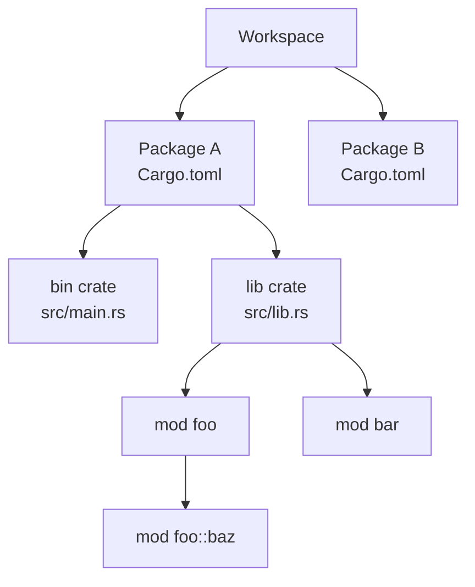

# 08. モジュールとクレート

## 学習目標

- `mod` `pub` `use` を使ってコードを分割できる
- ファイル分割のルール（`foo.rs` / `foo/mod.rs`）を知る
- crate と workspace の違いがわかる
- 外部 crate を `cargo add` で導入できる

## 用語整理

| 用語 | 意味 |
|-----|-----|
| crate | コンパイル単位（バイナリかライブラリ） |
| package | 1 つ以上の crate を含むプロジェクト（`Cargo.toml` がある単位） |
| module | crate 内の名前空間（`mod` で作る） |
| workspace | 複数 package をまとめて管理する仕組み |



| Rust | Go |
|------|----|
| crate | module（go.mod 単位） |
| module | package（ディレクトリ単位） |
| `pub` | 大文字始まり |

## プロジェクト

```bash
cd code
cargo new ch08-modules
cd ch08-modules
```

## モジュール宣言

`src/main.rs` 内に直接書く方法:

```rust
mod greetings {
    pub fn hello() -> String {
        "hello".to_string()
    }

    pub mod ja {
        pub fn hello() -> String {
            "こんにちは".to_string()
        }
    }
}

fn main() {
    println!("{}", greetings::hello());
    println!("{}", greetings::ja::hello());
}
```

`pub` を付けないと外から見えない（デフォルト private）。

## ファイル分割

`src/main.rs`:

```rust
mod greetings;     // ← src/greetings.rs か src/greetings/mod.rs を読む

fn main() {
    println!("{}", greetings::hello());
}
```

`src/greetings.rs`:

```rust
pub fn hello() -> String {
    "hello".to_string()
}
```

サブモジュールも切るなら:

```
src/
├── main.rs
└── greetings/
    ├── mod.rs        # 新スタイルでは greetings.rs に置き換え可
    ├── en.rs
    └── ja.rs
```

`src/greetings.rs`:

```rust
pub mod en;
pub mod ja;
```

`src/greetings/en.rs`:

```rust
pub fn hello() -> String { "Hello".into() }
```

呼び出し:

```rust
println!("{}", greetings::ja::hello());
```

## use（インポート）

毎回フルパスを書くのはだるいので `use` で持ち込む。

```rust
use greetings::ja;
println!("{}", ja::hello());

use greetings::en::hello;
println!("{}", hello());

use greetings::{en, ja};        // まとめて
use greetings::ja::hello as ja_hello;   // 別名

use std::collections::HashMap;          // 標準ライブラリ
use std::collections::*;                 // glob（多用しない）
```

`use` はモジュールの先頭に書くのがイディオム。

## 可視性ルール

| 修飾子 | 意味 |
|-------|-----|
| (なし) | private（同一モジュール内のみ） |
| `pub` | どこからでも |
| `pub(crate)` | クレート内に限定（推奨される範囲指定） |
| `pub(super)` | 親モジュールまで |
| `pub(in path)` | 任意のパスまで |

ライブラリの公開 API は `pub`、内部だけで使う API は `pub(crate)` が定石。

## バイナリ + ライブラリ

実は 1 package が同時にバイナリと共有可能なライブラリを持てる。

```
ch08-modules/
├── Cargo.toml
└── src/
    ├── lib.rs        # ライブラリ crate のルート
    └── main.rs       # バイナリ crate のルート
```

`src/lib.rs`:

```rust
pub fn add(a: i32, b: i32) -> i32 { a + b }
```

`src/main.rs`:

```rust
use ch08_modules::add;     // ← Cargo.toml の name（- は _ に）

fn main() {
    println!("{}", add(2, 3));
}
```

ロジックは `lib.rs` 配下に書き、`main.rs` は薄くする。テストやドキュメントとの相性が良くなる。

## バイナリを複数持つ

`src/bin/<name>.rs` に置けば、それぞれが独立したバイナリになる。

```
src/
├── lib.rs
├── main.rs              # cargo run でこれ
└── bin/
    ├── tool1.rs         # cargo run --bin tool1
    └── tool2.rs
```

## 外部 crate を使う

```bash
cargo add serde --features derive
cargo add serde_json
```

`Cargo.toml`:

```toml
[dependencies]
serde = { version = "1", features = ["derive"] }
serde_json = "1"
```

```rust
use serde::{Serialize, Deserialize};

#[derive(Serialize, Deserialize)]
struct User { id: u64, name: String }

fn main() {
    let u = User { id: 1, name: "Yuhei".into() };
    let json = serde_json::to_string(&u).unwrap();
    println!("{json}");
}
```

代表的な crate:

| 用途 | crate |
|-----|------|
| シリアライズ | `serde`, `serde_json`, `toml`, `serde_yaml` |
| エラー | `anyhow`, `thiserror` |
| ロギング | `tracing`, `log`, `env_logger` |
| HTTP クライアント | `reqwest` |
| HTTP サーバ | `axum`, `actix-web`, `rocket` |
| 非同期ランタイム | `tokio`, `async-std` |
| CLI | `clap` |
| 日付 | `chrono`, `time` |
| DB | `sqlx`, `diesel` |
| テスト | `assert_cmd`, `proptest`, `insta` |

## workspace

複数 package を 1 つのリポジトリで管理。

`Cargo.toml`（リポジトリルート）:

```toml
[workspace]
members = ["app", "domain", "infra"]
resolver = "3"
```

```
my-project/
├── Cargo.toml
├── app/
│   ├── Cargo.toml
│   └── src/main.rs
├── domain/
│   ├── Cargo.toml
│   └── src/lib.rs
└── infra/
    ├── Cargo.toml
    └── src/lib.rs
```

`app/Cargo.toml`:

```toml
[dependencies]
domain = { path = "../domain" }
```

DDD のレイヤード構成と相性が良い。「domain」は外部 crate に依存させず純粋に保つ、などの方針が表現できる。

## 演習

📝 **演習 8-1**: 03 章の `OrderStatus` enum と関連メソッドを `src/order.rs` に切り出し、`main.rs` から使えるようにせよ。

📝 **演習 8-2**: `src/lib.rs` と `src/main.rs` の両方を持つ構成にして、ロジックを lib に、CLI 入出力を main に分けよ。

📝 **演習 8-3**: `cargo add chrono` して、現在時刻を表示する main を書け。

```rust
use chrono::Local;

fn main() {
    let now = Local::now();
    println!("{}", now.format("%Y-%m-%d %H:%M:%S"));
}
```

## チェックリスト

- [ ] `mod` `pub` `use` の使い分けができる
- [ ] ファイル分割のルールを知っている
- [ ] `pub(crate)` の使い所がわかる
- [ ] `lib.rs` と `main.rs` の併用ができる
- [ ] `cargo add` で外部 crate を導入できる
- [ ] workspace の概念を知っている

## 落とし穴

⚠️ **`mod foo;` は「ファイルを読む」**: 場所は `src/foo.rs` か `src/foo/mod.rs`。両方あるとエラー。

⚠️ **`pub` を忘れる**: コンパイルエラー `function ... is private` で気づく。慣れるまでよく忘れる。

⚠️ **glob import は最小限に**: `use foo::*` は便利だが、何が来てるか分からなくなる。テストや prelude モジュール以外では避ける。

⚠️ **workspace の依存解決**: `[workspace.dependencies]` でバージョンを統一できる。各 package では `serde.workspace = true` のように書く。Rust 2024 以降は推奨。

⚠️ **crate 名のハイフン**: パッケージ名は `my-crate` のようにハイフン可、コード上は `my_crate` でアンダースコア。
