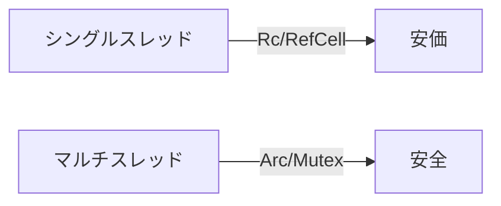

# 10. 並行プログラミング

Rust の並行性は「データ競合をコンパイル時に防ぐ」ことに特化している。所有権・借用の仕組みがそのまま並行安全性に直結する。これを「Fearless Concurrency」と呼ぶ。

## 学習目標

- `std::thread::spawn` でスレッドを起動できる
- `Send` / `Sync` トレイトの意味がわかる
- `Arc<Mutex<T>>` で値を共有・保護できる
- `std::sync::mpsc` チャネルで通信できる
- Go の goroutine + channel との対比ができる

## プロジェクト

```bash
cd code
cargo new ch10-concurrency
cd ch10-concurrency
```

## スレッドを起こす

```rust
use std::thread;
use std::time::Duration;

fn main() {
    let handle = thread::spawn(|| {
        for i in 1..=3 {
            println!("[child] {i}");
            thread::sleep(Duration::from_millis(100));
        }
    });

    for i in 1..=3 {
        println!("[main]  {i}");
        thread::sleep(Duration::from_millis(150));
    }

    handle.join().unwrap();
}
```

`spawn` は `JoinHandle<T>` を返し、`.join()` で終了を待ち戻り値を取る。Goroutine と違って「待たないとプロセスが終わる」点に注意（`main` が抜けたらスレッドも巻き込まれて終わる）。

## move キャプチャ

スレッドはどこで実行されるかわからないので、外の変数を借用するとライフタイムが足りない。所有権ごと取り込む `move` クロージャを使う。

```rust
let v = vec![1, 2, 3];

let handle = thread::spawn(move || {
    println!("{v:?}");          // v をスレッドに move
});

// println!("{v:?}");           // ❌ もう使えない
handle.join().unwrap();
```

これは「並行アクセスを防ぐ」型システムの効果。Go の goroutine だと共有変数を触れてしまうが、Rust ではコンパイラが許さない。

## Send と Sync

| トレイト | 意味 |
|---------|-----|
| `Send` | 値を別スレッドに「送れる」（所有権の移動が可） |
| `Sync` | 値を複数スレッドから「参照できる」（`&T` を共有して安全） |

ほとんどの型は自動で `Send + Sync` になる（auto trait）。例外:

- `Rc<T>`（参照カウントが非アトミック）→ `Send` でも `Sync` でもない
- `RefCell<T>`（実行時借用検査）→ `Sync` ではない（`Send` ではある）
- 生ポインタ `*const T` / `*mut T` → 両方なし

スレッドに渡そうとして「the trait Send is not implemented」と言われたら、その型がスレッドセーフでない、と解釈する。



## 共有所有: Arc<T>

`Arc` = Atomic Reference Counted。複数のオーナーで読み取り共有する。

```rust
use std::sync::Arc;
use std::thread;

let data = Arc::new(vec![1, 2, 3]);

let mut handles = vec![];
for i in 0..3 {
    let d = Arc::clone(&data);
    handles.push(thread::spawn(move || {
        println!("[{i}] {:?}", d);
    }));
}

for h in handles {
    h.join().unwrap();
}
```

`Arc::clone` は実体をコピーせずカウンタを増やすだけ。`Rc::clone` のスレッド対応版。

## 排他制御: Mutex<T>

書き込みも共有したいなら `Arc<Mutex<T>>`。

```rust
use std::sync::{Arc, Mutex};
use std::thread;

let counter = Arc::new(Mutex::new(0));

let mut handles = vec![];
for _ in 0..10 {
    let c = Arc::clone(&counter);
    handles.push(thread::spawn(move || {
        let mut n = c.lock().unwrap();   // ロック取得（PoisonError は unwrap）
        *n += 1;
    }));
}
for h in handles { h.join().unwrap(); }

println!("{}", *counter.lock().unwrap());   // 10
```

`lock()` は `MutexGuard<T>` を返す。スコープを抜けると自動で unlock される（RAII）。`Drop` の自動実行のおかげで「ロック解放忘れ」が起きない。

ほかに:

- `RwLock<T>`: 読み取り共有 / 書き込み排他
- `parking_lot::Mutex`: 標準より高速・軽量（外部 crate）
- `std::sync::atomic::AtomicU64` など: ロックフリーな数値操作

## チャネル: mpsc

`mpsc` = Multiple Producer, Single Consumer。送信側を clone して複数スレッドから送る、受信側は 1 つ。

```rust
use std::sync::mpsc;
use std::thread;

let (tx, rx) = mpsc::channel::<String>();

let tx2 = tx.clone();
thread::spawn(move || {
    tx.send("hello from t1".into()).unwrap();
});
thread::spawn(move || {
    tx2.send("hello from t2".into()).unwrap();
});

for received in rx.iter().take(2) {
    println!("got: {received}");
}
```

Go の channel との違い:

| 項目 | Rust mpsc | Go channel |
|-----|----------|-----------|
| 多対多 | 送信複数・受信単一 | 多対多OK |
| 型 | 送信側 `Sender<T>` と受信側 `Receiver<T>` | `chan T` |
| バッファ | 無制限 (channel) / 制限あり (sync_channel) | 容量指定可 |
| select | `crossbeam_channel` か `tokio::select!` を使う | 言語仕様 |
| close 検知 | 送信側が全部 drop → recv が Err | 言語仕様 |

実用ではより強力な `crossbeam-channel` や `tokio::sync::mpsc`（非同期版）を使うことが多い。

## scoped thread（Rust 1.63+）

ライフタイム参照をスレッドに渡せる新 API。

```rust
use std::thread;

let data = vec![1, 2, 3];

thread::scope(|s| {
    s.spawn(|| {
        println!("{data:?}");      // move 不要、参照で渡せる
    });
    s.spawn(|| {
        println!("{:?}", data);
    });
});
// scope 終了時に全スレッドが join される
```

短命な「ファンアウト → 集約」処理にとても便利。

## 演習

📝 **演習 10-1**: 4 つのスレッドを起こし、それぞれ別の `Vec<i32>` の合計を計算。`Arc<Mutex<Vec<i32>>>` で結果を集約する。

📝 **演習 10-2**: `mpsc` で「ワーカー 3 体 → 集約 1 体」のパイプラインを書け。各ワーカーは 1〜10 の数値を 1 秒間隔で送信、集約は受信した値を合計して標準出力。

📝 **演習 10-3**: 演習 10-2 を `thread::scope` で書き直し、`Arc` を取り除けるか試す。

📝 **演習 10-4**: 銀行口座 `Account { balance: i64 }` を `Arc<Mutex<_>>` で共有し、複数スレッドから `deposit` / `withdraw` を呼んで競合を起こさないことを確認せよ。残高がマイナスにならないこと。

## チェックリスト

- [ ] `thread::spawn` と `JoinHandle` の関係がわかる
- [ ] `move` クロージャの必要性が言える
- [ ] `Send` / `Sync` の役割がわかる
- [ ] `Arc<Mutex<T>>` のイディオムを書ける
- [ ] `mpsc` で 1:1 / N:1 を組める
- [ ] Go の channel と Rust mpsc の差を 2 点以上挙げられる

## 落とし穴

⚠️ **`Mutex::lock().unwrap()` の中身**: 別スレッドが panic で死ぬとロックが「poison」状態になり、`PoisonError` が返る。基本は `unwrap` でよい。

⚠️ **デッドロック**: 複数の Mutex を取る順序が違うと容易にデッドロック。Rust も型では防げない。設計で対処。

⚠️ **`Rc` と `Arc` の使い分け**: シングルスレッドなら `Rc`（軽い）、マルチスレッドなら `Arc`（アトミック）。間違えるとコンパイルエラー（`Send` not implemented）。

⚠️ **channel の close**: `Sender` がすべて drop されると `recv()` は `Err` を返す。これがループ終了の合図。

⚠️ **「送りすぎる」と OOM**: 無制限 channel にバンバン送るとメモリが膨らむ。バックプレッシャが要るなら `sync_channel(n)`。

⚠️ **panic の伝播**: スレッド内 panic は `JoinHandle::join` の `Err` として返る。main がそれを `unwrap` するか、明示的に処理しないと黙殺されたままになる。
