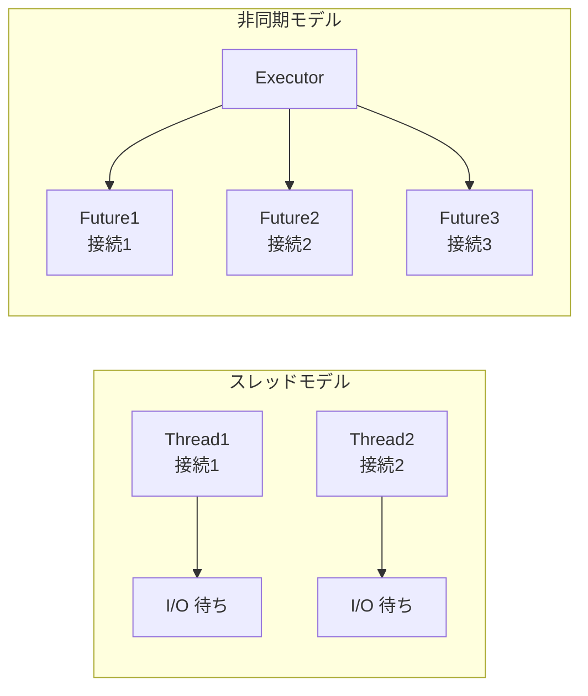
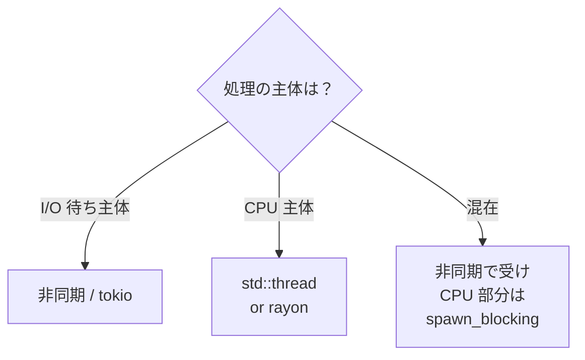

# 11. 非同期プログラミング

I/O 主体（ネットワーク・DB・ファイル）の処理を効率よく回すための仕組み。スレッドベース（10 章）と用途を使い分ける。

## 学習目標

- `async` / `await` の意味を理解する
- `Future` がどう動くかのざっくりした感覚を持つ
- `tokio` ランタイムでサーバ・クライアント的な処理を書ける
- スレッド並行と非同期並行の使い分けができる

## なぜ非同期が必要か

I/O 待ちの間、スレッドは何もしていない。N 接続を捌くなら N スレッド要るのか？ → 非同期なら少数のスレッドで多数の I/O を多重化できる。



Go は goroutine + ランタイム多重化が組み込み、Rust は言語に async シンタックスだけ提供しランタイムは別 crate（`tokio` / `async-std` / `smol`）から選ぶ。

## プロジェクト

```bash
cd code
cargo new ch11-async
cd ch11-async
cargo add tokio --features full
cargo add reqwest --features json
```

## async 関数と Future

```rust
async fn say_hi() -> String {
    "hi".to_string()
}
```

`async fn` は呼び出すと「`Future` を返す」関数になる。`Future` は「将来値を返すかもしれない計算」。`.await` するまで何も走らない（ここが Go と決定的に違う）。

```rust
let fut = say_hi();          // ここではまだ何も実行されてない
let s = fut.await;           // ここでようやく実行される
```

⚠️ `.await` できるのは `async` 関数の中だけ。`main` を `async` にするにはランタイムが必要。

## tokio で main を async にする

```rust
#[tokio::main]
async fn main() {
    let s = say_hi().await;
    println!("{s}");
}

async fn say_hi() -> String {
    "hi".to_string()
}
```

`#[tokio::main]` 属性マクロが「ランタイムを立ち上げて main の Future を実行」のお膳立てをしてくれる。

## tokio の主要 API

```rust
use tokio::time::{sleep, Duration};

#[tokio::main]
async fn main() {
    // 1. sleep
    sleep(Duration::from_millis(100)).await;

    // 2. spawn（並行タスクを起こす）
    let h1 = tokio::spawn(async {
        sleep(Duration::from_millis(100)).await;
        "task1 done"
    });
    let h2 = tokio::spawn(async {
        sleep(Duration::from_millis(50)).await;
        "task2 done"
    });

    // join で結果を待つ
    println!("{}", h1.await.unwrap());
    println!("{}", h2.await.unwrap());

    // 3. join!（複数の Future を並列に待つ）
    let (a, b) = tokio::join!(
        async { 1 + 1 },
        async { 2 + 2 },
    );
    println!("{a} {b}");

    // 4. select!（先に終わったほう）
    tokio::select! {
        v = sleep(Duration::from_millis(100)) => println!("100ms 経過"),
        v = sleep(Duration::from_millis(200)) => println!("200ms 経過"),
    };
}
```

| 機能 | 用途 |
|-----|-----|
| `tokio::spawn` | バックグラウンドで Future を回す |
| `tokio::join!` | 複数 Future を並列実行・全て完了を待つ |
| `tokio::try_join!` | 同上で Result 対応 |
| `tokio::select!` | 複数 Future のどれかが完了したら抜ける |

## HTTP クライアント例（reqwest）

```rust
use anyhow::Result;
use serde::Deserialize;

#[derive(Debug, Deserialize)]
struct Post {
    id: u64,
    title: String,
}

#[tokio::main]
async fn main() -> Result<()> {
    let url = "https://jsonplaceholder.typicode.com/posts/1";
    let post: Post = reqwest::get(url).await?.json().await?;
    println!("{post:?}");
    Ok(())
}
```

`reqwest::get` は `Future`、`.json()` も `Future`。両方 `await` する。

### 並列に複数リクエスト

```rust
use futures::future::join_all;     // cargo add futures

#[tokio::main]
async fn main() -> Result<()> {
    let urls = vec![
        "https://jsonplaceholder.typicode.com/posts/1",
        "https://jsonplaceholder.typicode.com/posts/2",
        "https://jsonplaceholder.typicode.com/posts/3",
    ];

    let futures = urls.into_iter().map(|u| async move {
        reqwest::get(u).await?.text().await
    });

    let results: Vec<_> = join_all(futures).await;
    for r in results {
        println!("{}", r?);
    }
    Ok(())
}
```

`join_all` で複数の Future を並列実行。`tokio::spawn` を使うと別スレッドプールで動かせる（`Send` 必要）。

## tokio の同期プリミティブ

10 章の `std::sync::Mutex` を非同期コードで使うのはアンチパターン。`.await` がブロックされている間に他のタスクが進めない。

代わりに `tokio::sync::Mutex` を使う:

```rust
use std::sync::Arc;
use tokio::sync::Mutex;

let counter = Arc::new(Mutex::new(0));
let c = counter.clone();
tokio::spawn(async move {
    let mut n = c.lock().await;     // .await できる
    *n += 1;
});
```

ただし「クリティカルセクションが極めて短い」なら `std::sync::Mutex` でも実用上問題ない。

ほかに:

- `tokio::sync::RwLock`
- `tokio::sync::mpsc`（非同期チャネル）
- `tokio::sync::oneshot`（一発限りの通知）
- `tokio::sync::broadcast`（複数受信）

## ファイル I/O

```rust
use tokio::fs;

#[tokio::main]
async fn main() -> std::io::Result<()> {
    let s = fs::read_to_string("Cargo.toml").await?;
    println!("{s}");
    Ok(())
}
```

`std::fs` は同期版。`.await` を含むコードでは `tokio::fs` を使う。

## スレッドと非同期の使い分け



| 用途 | 使うもの |
|-----|--------|
| 大量の I/O 接続を捌く | tokio |
| CPU を食う計算 | std::thread / rayon |
| 単発のバックグラウンド処理 | std::thread |
| HTTP サーバ・クライアント | tokio + axum/reqwest |
| データ並列計算 | rayon |

`tokio::task::spawn_blocking` で「重い CPU 処理を専用スレッドに逃がす」のが定番テクニック。

## async fn のシグネチャの正体

```rust
async fn fetch(url: &str) -> Result<String> { ... }

// 実は以下と同じ
fn fetch<'a>(url: &'a str) -> impl Future<Output = Result<String>> + 'a { ... }
```

戻り値が `impl Future` になる。トレイトオブジェクトとして扱いたいときは `Box<dyn Future<Output = ...>>`、または `async-trait` クレートを使う。

## 演習

📝 **演習 11-1**: `tokio::time::sleep` を使い、非同期に 1〜5 まで 100ms 間隔で出力する関数を書け。

📝 **演習 11-2**: 3 つの URL を並列に GET し、それぞれのバイト数を合計して表示するプログラムを書け（演習が動かなければ存在する任意の URL に変える）。

📝 **演習 11-3**: `tokio::sync::mpsc` を使い、ワーカー 3 体が 1 秒おきに整数を生産し、集約タスクが受け取って合計を出すパイプラインを書け。

📝 **演習 11-4**: 「2 秒以内に応答が返らなければタイムアウト」を `tokio::select!` と `tokio::time::sleep` で実装せよ。

## チェックリスト

- [ ] `async fn` の戻り値が `Future` であることを言える
- [ ] `.await` の意味を説明できる
- [ ] `#[tokio::main]` の役割を知っている
- [ ] `join!` と `select!` を使い分けられる
- [ ] `std::sync::Mutex` と `tokio::sync::Mutex` の使い分けが言える
- [ ] スレッドと非同期の使い分けが言える

## 落とし穴

⚠️ **`async fn` を呼んだだけでは何も走らない**: `.await` か `tokio::spawn` が必要。Go の `go f()` のような副作用は起きない。

⚠️ **非同期でブロッキング I/O は厳禁**: `std::fs::read` を `async fn` 中で呼ぶと、その間ランタイムが止まる。`tokio::fs` を使うか `spawn_blocking` で逃がす。

⚠️ **ランタイムは 1 つだけ選ぶ**: tokio と async-std の機能を混ぜるとほぼ動かない。プロジェクト最初に決めておく。

⚠️ **`Send` 境界**: `tokio::spawn` の Future は `Send + 'static` が必要。中で `Rc` や `RefCell` を使うとエラーになる。`Arc` / `Mutex` に置き換える。

⚠️ **`.await` 中の借用**: `await` を跨ぐ借用は要注意。`MutexGuard` を持ったまま `await` すると、別タスクが永久に進めなくなる。クリティカルセクションを最小に。

⚠️ **Future はキャンセル可能**: `select!` で勝った方以外はその場で drop される。中途半端な状態を残す処理は要設計。
