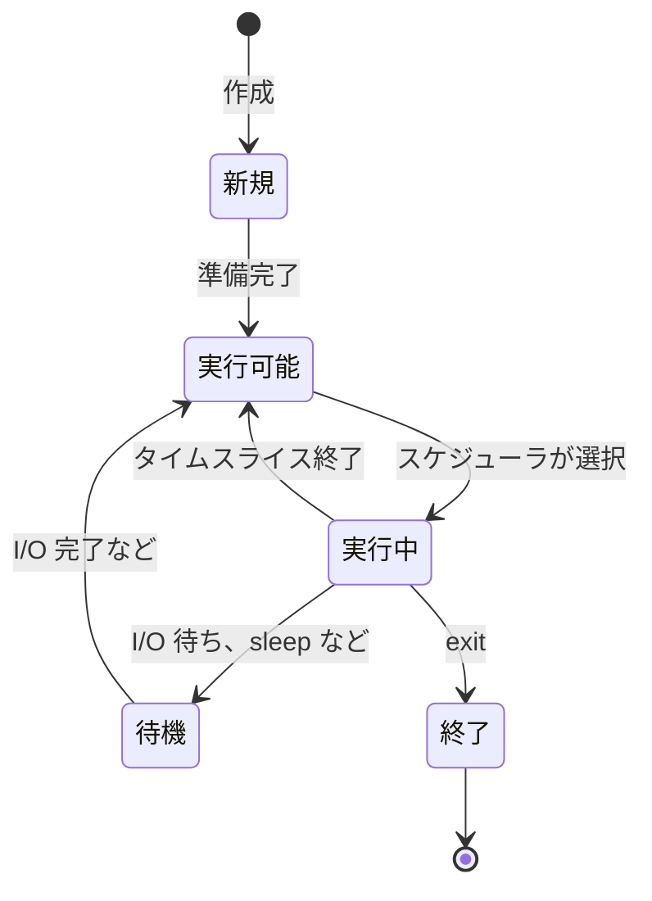

# 解説: プロセスとスレッド (OS の基礎)

[stack-and-heap.md](stack-and-heap.md) の延長線上にある OS の基礎知識。Rust の所有権が「1 プロセス内の仮想メモリ空間」の話だと理解した上で、その外側 (プロセスを束ねる OS 視点、複数プロセスやスレッド) を整理する。

> プロセス = 独立したメモリ空間を持つ実行単位、スレッド = 同じメモリを共有する軽量な実行単位。

[10-concurrency.md](../10-concurrency.md) でスレッド・`Mutex` ・`Arc` を本格的に扱う時の前提として知っておくと安心。

## プロセスとは

実行中のプログラムの単位。OS にとっての「管理対象」。

各プロセスは:

- 自分専用の仮想メモリ空間を持つ ([stack-and-heap.md](stack-and-heap.md) で扱った仮想空間がプロセスごとに 1 つ)
- 自分専用のファイルディスクリプタテーブル、シグナルハンドラなどを持つ
- 他プロセスのメモリを直接読み書きできない (分離されている)

### PCB (Process Control Block)

OS がプロセスを管理するためにカーネル側に持つデータ構造。1 プロセスにつき 1 つ。

PCB に入っている主な情報:

| 項目 | 内容 |
|---|---|
| PID | プロセス ID (一意な番号) |
| 状態 | 実行中 / 待機 / ブロックなど |
| プログラムカウンタ | 次に実行する命令のアドレス |
| レジスタ値 | コンテキストスイッチで退避する CPU 状態 |
| メモリマップ情報 | 仮想アドレス空間の管理情報 (ページテーブルへの参照) |
| 開いているファイル | ファイルディスクリプタ表 |
| 親プロセス PID | 階層管理用 |

プロセスを切り替える時 (コンテキストスイッチ) は、この PCB の情報を保存・復元する。

#### Linux の task_struct

Linux では PCB は `struct task_struct` という巨大な構造体として実装されている (`include/linux/sched.h` で定義)。1 プロセスにつき 1 つ存在し、サイズは数 KB〜十数 KB に及ぶ。あらゆるプロセス情報がここに集約されているので、Linux カーネルのソースを読む時はまずここから入ると見通しが立ちやすい。

#### File Descriptor Table

各プロセスは「開いているファイルの一覧表」を持つ。fd (file descriptor) は整数番号で、ファイル・ソケット・パイプなど、あらゆる I/O 対象を統一的に扱う仕組み。

| fd | 用途 |
|---|---|
| 0 | 標準入力 (stdin) |
| 1 | 標準出力 (stdout) |
| 2 | 標準エラー出力 (stderr) |
| 3 以降 | `open()` / `socket()` / `pipe()` などで確保 |

特徴:

- プロセスごとに独立 (fd 番号は別プロセスでは別のものを指す)
- `fork()` で複製される (親と子で同じファイルを参照)
- `exec()` でも基本そのまま受け継がれる (`FD_CLOEXEC` フラグで close できる)

シェルパイプ `a | b` は、シェルが `pipe()` でパイプを作って、a の fd 1 (stdout) と b の fd 0 (stdin) を繋ぎ替える、という仕組みで実現されている。

`lsof -p <PID>` でそのプロセスが開いている fd 一覧が見られる。

### プロセスの状態遷移

プロセスは複数の状態を行き来する。



| 状態 | 意味 |
|---|---|
| 実行可能 (Ready) | CPU が空けば動ける |
| 実行中 (Running) | 今 CPU を使っている |
| 待機 (Blocked / Waiting) | I/O やリソース待ちで CPU を使えない |
| 終了 (Terminated) | exit 済み |

#### 割り込み可能な待機 / 不可能な待機

Linux では「待機」状態がさらに 2 種類に分かれる。

| 状態 | ps での表記 | 意味 |
|---|---|---|
| 割り込み可能な待機 (`TASK_INTERRUPTIBLE`) | S (Sleeping) | シグナルで起こせる |
| 割り込み不可能な待機 (`TASK_UNINTERRUPTIBLE`) | D (Disk sleep) | シグナルでも起こせない |

- 割り込み可能 (S): ネットワーク I/O やタイマー待ちなど。`Ctrl+C` (`SIGINT`) や `kill` で殺せる
- 割り込み不可能 (D): ローカルディスク I/O 待ちなど。`kill -9` も効かない。OS が触れず、デバイスが応答するまで待つしかない

NFS マウント先が応答しなくなった時、そのファイルにアクセスしたプロセスが D 状態でハングして reboot するしかない、というのが伝統的なトラブルパターン。`ps` で `STAT` 列が `D` のプロセスを見たら、まずディスク・ネットワーク I/O を疑う。

## スケジューラ

CPU は同時に 1 プロセス (正確には 1 コアあたり 1 スレッド) しか実行できない。多数の実行可能プロセスから「次に動かすやつ」を選ぶのがスケジューラ。

代表的なアルゴリズム:

- ラウンドロビン: 順番に同じ時間ずつ
- 優先度ベース: 優先度の高いものから
- CFS (Completely Fair Scheduler): Linux のデフォルト。各プロセスに公平に CPU 時間を割り当てる

ユーザーから見ると「複数のプログラムが同時に動いている」ように見えるが、実際は超高速に切り替えているだけ (ハードウェア的に並列なのは複数コアの数まで)。

### nice 値 (プロセスの優先度)

各プロセスは nice 値という整数で「CPU の取り合いでの遠慮度」を表現する。

| 値 | 意味 |
|---|---|
| -20 | 最も優先度が高い (CPU を譲らない) |
| 0 | デフォルト |
| 19 | 最も優先度が低い (CPU を他にたくさん譲る) |

「nice (親切)」の名前の由来は「値が高いほど他のプロセスに CPU を譲る = 親切」という意味から。

```fish
nice -n 10 long-running-task   # nice 値 10 で起動 (低優先度)
renice -n 5 -p 1234            # PID 1234 の nice 値を 5 に変更
```

一般ユーザーは nice 値を上げる (優先度を下げる) ことしかできない。下げる (-1 〜 -20、優先度を上げる方向) には root 権限が必要。バックグラウンドのバッチ処理を `nice` で起動して、対話プロセスを邪魔しないようにする、という運用が伝統的にある。

`top` や `htop` で `NI` 列に表示されているのが nice 値。

## コンテキストスイッチ

プロセスを切り替える時の処理。CPU の状態を保存して、別プロセスの状態を復元する。

```
プロセス A 実行中
    ↓
タイマー割り込み or I/O 待ち
    ↓
[1] A の CPU 状態 (レジスタ、PC) を A の PCB に退避
[2] スケジューラが次のプロセス B を選ぶ
[3] B の PCB から CPU 状態を復元
[4] MMU のページテーブルを B 用に切り替え
    ↓
プロセス B 実行中
```

オーバーヘッドの正体:

- レジスタ退避・復元 (数十ナノ秒〜)
- ページテーブル切り替えに伴う TLB (Translation Lookaside Buffer) のフラッシュ → 仮想→物理アドレス変換のキャッシュが無効化される
- CPU キャッシュも無効化されがち (プロセスごとにアクセス領域が違う)

数マイクロ秒〜数十マイクロ秒のコストがかかる。Web サーバーなどで「プロセス数を闇雲に増やさない」のはこのオーバーヘッドが理由の 1 つ。

## プロセス間通信 (IPC: Inter-Process Communication)

プロセスは互いにメモリ分離されているので、通信には専用の仕組みが要る。

| 方式 | 特徴 | 速度 | 用途例 |
|---|---|---|---|
| パイプ (`pipe`) | 単方向の FIFO ストリーム。`a \| b` のシェルパイプ | 中 | コマンドチェーン |
| 名前付きパイプ (FIFO) | ファイルシステム上に名前を持つパイプ | 中 | プロセス間でファイル名経由 |
| メッセージキュー | カーネルが管理するメッセージ列。受信側がいつでも取れる | 中 | 非同期通信 |
| 共有メモリ | 複数プロセスが同じ物理メモリ領域をマップ | ◎ 高速 | 大量データの共有 |
| ソケット | TCP/UDP で同マシンや別マシン間で通信 | 中 | ネットワーク汎用 |
| シグナル | プロセスに「割り込み」を送る (`SIGTERM` など) | ◎ 軽量だが情報量小 | プロセス終了通知など |

### 共有メモリと排他制御

共有メモリは「複数プロセスが同じ物理メモリ領域に MMU 経由でマップする」仕組みで、コピーせずデータを共有できるので最速。ただし:

- 同時書き込みでデータが壊れる
- 順序が保証されない

ので、排他制御 (synchronization) が必要。

## Mutex と Semaphore

排他制御の代表的な 2 つ。よく混同される。

### Mutex (Mutual Exclusion)

「1 人だけが持てる鍵」。

```
スレッド A: lock() → 鍵を取る → クリティカルセクション → unlock() で返す
スレッド B: lock() → A が持っているので待つ → A が unlock したら取れる
```

| 性質 | 内容 |
|---|---|
| 保護対象 | 1 つのリソースへの排他アクセス |
| 所有権 | あり (acquire したスレッドだけが release できる) |
| カウント | 0 か 1 (持っている / いない) |

### Semaphore

「N 個のリソースを管理するカウンター」。

```
セマフォの初期値 = 3 (例: DB 接続プールに 3 つ)

スレッド A: acquire() → 3 → 2
スレッド B: acquire() → 2 → 1
スレッド C: acquire() → 1 → 0
スレッド D: acquire() → 0 なので待つ
スレッド A: release() → 0 → 1 → D が取れる
```

| 性質 | 内容 |
|---|---|
| 保護対象 | N 個のリソースを並行利用 |
| 所有権 | なし (どのスレッドからも release 可能) |
| カウント | 0 〜 N |

### 違い

| 観点 | Mutex | Semaphore |
|---|---|---|
| 個数 | 1 | N |
| 所有権 | あり | なし |
| 用途 | 排他制御 | リソースプール、シグナリング |

「Mutex は N=1 のセマフォとほぼ同じ」と言えなくもないが、所有権の有無で実装も挙動も違う。

実用的には:

- 「クリティカルセクションを 1 人だけに通したい」 → Mutex
- 「DB 接続プールで最大 10 並列まで」 → Semaphore

## スレッド

プロセスの中で並行に動く実行単位。

### プロセスとの関係

```
プロセス
├── 仮想メモリ空間 (ヒープ、グローバル変数)
├── スレッド A (独自のスタック、レジスタ)
├── スレッド B (独自のスタック、レジスタ)
└── スレッド C (独自のスタック、レジスタ)
```

スレッドが共有するもの: ヒープ、グローバル変数、ファイルディスクリプタ
スレッドが個別に持つもの: スタック、レジスタ、プログラムカウンタ

### スレッドのメリット

| メリット | 理由 |
|---|---|
| 高速なコンテキストスイッチ | 同じプロセス内なのでメモリマップ (ページテーブル) を切り替えなくていい |
| メモリ共有が容易 | ヒープが共有されているので、データを直接やり取りできる |
| 軽量 | プロセス生成より圧倒的に低コスト |

### スレッドのデメリット

| デメリット | 理由 |
|---|---|
| 競合状態 (race condition) | メモリを共有するので、同時アクセスで壊れる |
| 排他制御が必要 | Mutex などで明示的に守る必要がある |
| 単一障害点 | 1 つのスレッドがクラッシュするとプロセス全体が落ちる |

プロセスとは違い、スレッドは「分離されていない」のがメリットでもデメリットでもある。

### Rust と並行性

Rust の所有権ルール (`&T` と `&mut T` を同時に持てない) は、シングルスレッドでもマルチスレッドでも同じ思想で動く。さらに:

- `Send` トレイト: スレッド間で値を移動できる
- `Sync` トレイト: スレッド間で参照を共有できる
- `Mutex<T>` / `Arc<T>`: スレッド間で安全に共有するための型

これらを使うと「データ競合をコンパイル時に防ぐ」が成立する。Go の goroutine + channel と思想は近いが、Rust は型レベルで安全性を保証する。詳しくは [10-concurrency.md](../10-concurrency.md)。

## プロセスの親子関係 (Unix)

Unix 系 OS では、プロセスはツリー構造で管理される。

```
init (PID 1)              ← OS 起動時の最初のプロセス
├── Process A (PID 100)
│   ├── Process A1 (PID 101)
│   └── Process A2 (PID 102)
├── Process B (PID 200)
└── Process C (PID 300)
```

### fork() と exec()

新しいプロセスを作る基本パターン。

```c
pid_t pid = fork();   // 親プロセスを「複製」して子プロセスを作る

if (pid == 0) {
    // 子プロセス側 (fork は子では 0 を返す)
    execvp("ls", args);   // 別のプログラムに置き換える
} else if (pid > 0) {
    // 親プロセス側 (fork は親には子の PID を返す)
    wait(NULL);   // 子の終了を待つ
}
```

| システムコール | 役割 |
|---|---|
| `fork()` | 自分の複製として子プロセスを作る |
| `exec()` | 自プロセスを別のプログラムで置き換える |
| `wait()` | 子プロセスの終了を待ち、終了ステータスを受け取る |
| `exit()` | プロセスを終了する |


シェルで `ls` を打つと、シェルが fork して子で exec("ls") している。`ps -ef` で見える親子関係はこれで作られる。

### Copy-on-Write (CoW)

`fork()` で子プロセスを作る時、本当にメモリ全部を物理的に複製するとコストが大きすぎる (例: 1GB のメモリを使うプロセスが fork するたびに 1GB コピーしていたら耐えられない)。

そこで Linux は Copy-on-Write という最適化を行う。

```
fork() 直後:
親プロセス ──┐
            ├──→ 物理メモリ (Read-only にマーク)
子プロセス ──┘

どちらかが書き込もうとした瞬間:
親プロセス ──→ 物理メモリ A (元の内容)
子プロセス ──→ 物理メモリ B (書き込まれた内容、ここで初めてコピー)
```

仕組み:

1. `fork()` 直後、親と子は同じ物理メモリを共有 (ページテーブル経由で)
2. 共有ページは Read-only としてマークされる
3. どちらかが書き込もうとすると → ページフォールト発生 → カーネルが物理ページを複製 → そのプロセスのページテーブルだけ書き込み可能な新ページに張り替える

メリット:

- `fork()` 自体が圧倒的に速い (ページテーブルだけコピーすれば良い)
- メモリも節約 (両者が変更しない部分は共有のまま)

特に「`fork()` の直後に `exec()` で別プログラムに置き換える」パターン (シェルが外部コマンドを起動する典型例) では、複製したメモリは `exec()` で全部捨てられる。CoW のおかげで「無駄な複製」が起きない。

これは Rust の `Cow<T>` (clone-on-write) という型と思想が同じ。値が変更されるまではコピーを遅延する。Rust の `Cow<T>` は [06-collections-iterators.md](../06-collections-iterators.md) 周辺で扱う。

### ゾンビプロセス (Zombie)

子プロセスが終了したのに、親が `wait()` で終了ステータスを受け取っていない状態。

- プロセスはメモリは解放されているが、PCB だけ残っている (終了ステータスを保持するため)
- 親が `wait()` を呼ぶと「成仏」する
- 親が呼ばないままだと、PCB が溜まり続けて PID 枯渇の原因になる

```
子プロセス: exit() → ゾンビ化 (PCB だけ残る)
親プロセス: wait() → ゾンビが消える (成仏)
```

`ps` で `STAT` 列が `Z` なのがゾンビ。

### 孤児プロセス (Orphan)

親が先に死んで、子が取り残された状態。

- 子プロセスは生き続ける
- init (PID 1) が新しい親として引き取る (re-parenting)
- init が代わりに `wait()` してくれるので、子が終わったらきちんと回収される

```
親プロセス: 先に exit
子プロセス: 孤児になる → init が引き取る → init がいずれ wait してくれる
```

なので孤児プロセス自体は害悪ではない (引き取り手がいるので)。問題なのはゾンビの方。

## Rust 学習との関係

| 概念 | Rust ハンズオンとの接続 |
|---|---|
| 仮想メモリ空間 | [stack-and-heap.md](stack-and-heap.md) で扱った話。所有権はこの空間内の話 |
| スレッド・共有メモリ | [10-concurrency.md](../10-concurrency.md) で `thread::spawn`、`Arc<Mutex<T>>` を使う時の前提 |
| プロセス間通信 (パイプ・ソケット) | std::process、ネットワーク I/O を扱う時に登場 |
| シグナル | デーモン化、graceful shutdown を実装する時 |
| fork / exec | std::process::Command で外部コマンドを呼ぶ時、内部でこれが走る |

ch10 で「`Arc<Mutex<Vec<T>>>` をスレッド間で共有する」みたいなパターンが出てきた時、「ヒープに置いた Vec を、スレッド A と B が共有してアクセスする。Mutex で排他制御している」と読めるとスッと入る。今の知識はその下地。

## まとめ

- プロセス = 独立した仮想メモリ空間を持つ実行単位
- OS は PCB でプロセスを管理し、スケジューラがコンテキストスイッチで切り替える
- プロセス間の通信には IPC (パイプ・共有メモリ・ソケットなど) が必要
- 共有メモリは速いが排他制御 (Mutex / Semaphore) が必要
- スレッド = 同じプロセス内で並行に動く軽量な実行単位、メモリを共有する
- スレッドは速くて軽いが競合管理が必要、1 つの障害でプロセス全体が落ちる
- Unix では fork / exec で子プロセスを作り、wait で終了を回収する
- ゾンビは wait で成仏、孤児は init が引き取る

Rust の所有権・借用ルールはシングルスレッド内で完結する話だが、ch10 で「複数スレッドで安全に共有する」を扱う時、ここで触れたメモリ共有・排他制御の知識が直接効いてくる。
